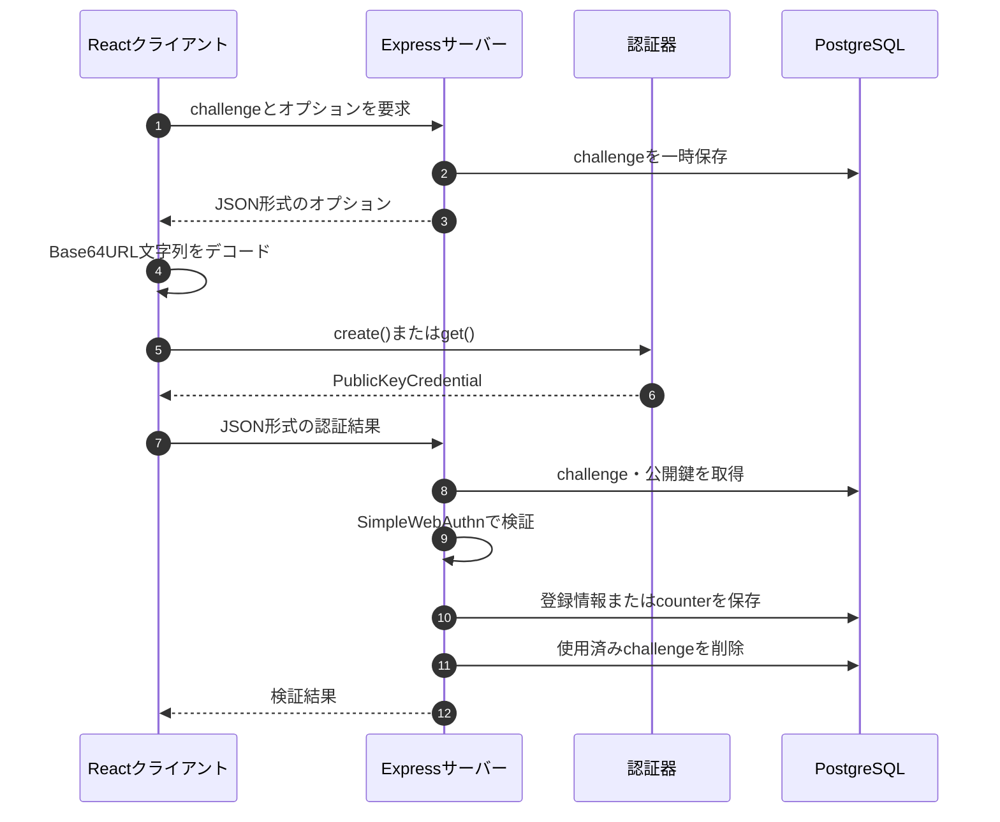

## はじめに

本記事では、ブラウザ標準のWebAuthn APIを直接呼び出し、サーバー側で`@simplewebauthn/server`を使って登録・認証結果を検証するまでを整理する。

前提となるパスキー、FIDO2、WebAuthn、認証器の関係は入門編で扱った。本記事の範囲は、登録・認証ポップアップを表示した後、実際にブラウザとサーバーの間でデータを受け渡す部分である。

今回の実装方針は次のとおりである。

- クライアントでは`@simplewebauthn/browser`を使用しない
- `navigator.credentials.create()`と`navigator.credentials.get()`を直接呼び出す
- サーバーでは`@simplewebauthn/server`を使用する
- challengeとパスキーの情報はPostgreSQLへ保存する

## 1. 使用技術

| 区分 | 使用技術 |
|---|---|
| フロントエンド | React、TypeScript、Vite |
| バックエンド | Express、TypeScript |
| WebAuthn検証 | `@simplewebauthn/server` 13系 |
| データベース | PostgreSQL、Prisma |
| ローカル環境のRP ID | `localhost` |
| ローカル環境のOrigin | `http://localhost:5173` |

`localhost`はWebAuthnの開発用途で使用できる。本番環境ではHTTPSが必要である。

## 2. 実装全体の対応関係

登録と認証では、呼び出すWebAuthn APIと返される`response`の型が異なる。

|処理| 登録 | 認証 |
|---|---|---|
|API| navigator.credentials.**create**() | navigator.credentials.**get**() | 
|option|PublicKeyCredential<br>**Creation**Options|PublicKeyCredential<br>**Request**Options|
|responce| AuthenticatorAttestationResponse | PublicKeyCredentialRequestOptions | 
|検証<br>関数|verify**Registration**Response() | verify**Authentication**Response()|



## 3. WebAuthn APIが扱うデータ

### 3.1 JSONとバイナリの境界

HTTP APIではchallengeやCredential IDをBase64URL文字列として扱う。

一方、WebAuthn APIの`challenge`、`user.id`、`excludeCredentials[].id`などは`BufferSource`を要求する。

そのため、以下のような変換処理が必要である

```text
サーバー
Base64URL文字列
    ↓ デコード
ブラウザ
Uint8Array・ArrayBuffer
    ↓ navigator.credentials.create() / get()
認証器
```

`ArrayBuffer`はバイナリデータを保持するメモリ領域であり、`Uint8Array`はその内容を1バイトずつ参照するためのビューである。

```typescript
type BufferSource = ArrayBuffer | ArrayBufferView
```

今回のクライアントでは、Base64URL文字列を`Uint8Array`へ変換する処理を用意した。

```typescript
import { Buffer } from 'buffer'

const decodeBase64Url = (value: string): Uint8Array => {
  const base64 = value.replace(/-/g, '+').replace(/_/g, '/')
  return Uint8Array.from(Buffer.from(base64, 'base64'))
}

const encodeBase64Url = (value: Uint8Array): string => {
  const base64 = Buffer.from(value).toString('base64')
  return base64
    .replace(/\+/g, '-')
    .replace(/\//g, '_')
    .replace(/=+$/, '')
}
```

### 3.2 PublicKeyCredential**Creation**Options


`navigator.credentials.create()`の`publicKey`へ渡す、登録用のオプションである。

```typescript
const credential = await navigator.credentials.create({
  publicKey: creationOptions,
})
```

主要なプロパティは次のとおりである。

- **必須プロパティ**
  - `challenge`、`rp`、`user`、`pubKeyCredParams`
- **任意プロパティ**
  - `timeout`、`excludeCredentials`、`authenticatorSelection`、`hints`、`attestation`、`extensions`

`BufferSource`は`ArrayBuffer | ArrayBufferView`を表し、実装では`Uint8Array`を渡すことが多い。具体的な値は後述のスニペットで示す。

型と取り得る値の全体像を簡略化すると次のようになる。`?`は任意プロパティ、`|`は複数の値のいずれかを表す。

```typescript
type PublicKeyCredentialCreationOptionsOverview = {
  challenge: ArrayBuffer | ArrayBufferView
  rp: {
    id?: string
    name: string
  }
  user: {
    id: ArrayBuffer | ArrayBufferView
    name: string
    displayName: string
  }
  pubKeyCredParams: Array<{
    type: 'public-key'
    alg: number // 代表例: -7 (ES256) | -257 (RS256) | -8 (EdDSA)
  }>
  timeout?: number
  excludeCredentials?: Array<{
    type: 'public-key'
    id: ArrayBuffer | ArrayBufferView
    transports?: AuthenticatorTransport[]
  }>
  authenticatorSelection?: {
    residentKey?: 'required' | 'preferred' | 'discouraged'
    userVerification?: 'required' | 'preferred' | 'discouraged'
    authenticatorAttachment?: 'platform' | 'cross-platform'
    requireResidentKey?: boolean
  }
  hints?: string[]
  attestation?: 'none' | 'indirect' | 'direct' | 'enterprise'
  extensions?: AuthenticationExtensionsClientInputs
}
```

- `challenge`（`BufferSource`、必須）
  - サーバーが生成する、登録処理ごとに異なるランダム値。
  - リプレイ攻撃を防ぐために使用する。ブラウザーはchallengeを`clientDataJSON`に含め、そのハッシュが登録結果に結び付けられる。
  - サーバーは、返されたchallengeが発行済みの値と一致するか検証する。
  - HTTP APIではBase64URL文字列として受け取り、WebAuthn APIへ渡す前に`Uint8Array`などへ変換する。

- `rp`（`PublicKeyCredentialRpEntity`、必須）
  - パスキーを登録するWebサービスの情報をまとめたオブジェクト。
  - `id`（`string`、任意）
    - Relying Party ID。パスキーを利用できる範囲を決めるドメイン。
    - 省略すると、呼び出し元Originのドメインが使われる。
    - `https://example.com`のようなスキームや、`example.com:3000`のようなポート番号は含めない。
    - Google Password Managerでは、通常「ウェブサイト」として表示される値。
  - `name`（`string`、必須）
    - RPの人間向けの表示名。
    - 多くのクライアントで表示されないため、WebAuthn Level 3では非推奨。
    - 後方互換性のため、現在も必須メンバーとして残されている。
    - 安全な既定値として`rp.id`と同じ値を設定できる。
    - 仕様：[PublicKeyCredentialEntity](https://www.w3.org/TR/webauthn-3/#dictionary-pkcredentialentity)

- `user`（`PublicKeyCredentialUserEntity`、必須）
  - 資格情報が作成されるユーザーアカウントを記述するオブジェクト。
  - `id`（`BufferSource`、必須）
    - サービス内部でユーザーを一意に識別する、最大64バイトの不透明なID。
    - サービス側が用意した変更されない値を使う。メールアドレスなどの個人情報は直接入れない。
    - Discoverable Credentialによる認証では、`userHandle`としてRPへ返される。
  - `name`（`string`、必須）
    - ユーザーアカウントを見分けるための識別名。メールアドレスやユーザー名を指定することが多い。
    - Google Password Managerでは、通常「ユーザー名」として表示される値。
  - `displayName`（`string`、必須）
    - ユーザーに見せるための読みやすい表示名。
    - 例：`'Alex Müller'`、`'Alex Müller (ACME Co.)'`、`'田中倫'`。

- `pubKeyCredParams`（`PublicKeyCredentialParameters[]`、必須）
  - RPが対応する公開鍵資格情報の種類と署名アルゴリズムを、優先順に並べた配列。
  - `type`（`'public-key'`、必須）
    - 作成する公開鍵資格情報の種類。現在は`'public-key'`のみ。
  - `alg`（`number`、必須）
    - 公開鍵の署名アルゴリズムを示すCOSEアルゴリズムID。
    - 代表値は`-7` = ES256、`-257` = RS256、`-8` = EdDSA。

- `timeout`（`number`、任意）
  - ブラウザーへ伝える処理時間の目安。単位はミリ秒で、ブラウザーが上書きする場合がある。

- `excludeCredentials`（`PublicKeyCredentialDescriptor[]`、任意）
  - 登録済みのCredential IDを指定し、同じ資格情報の重複登録を防ぐ。
  - 各要素は`type`、`id`、任意の`transports`を持つ。

- `authenticatorSelection`（`AuthenticatorSelectionCriteria`、任意）
  - 登録に使う認証器やユーザー検証の条件を指定するオブジェクト。
  - `residentKey`：`'required' | 'preferred' | 'discouraged'`。Discoverable Credentialの必要性を指定する。
  - `userVerification`：`'required' | 'preferred' | 'discouraged'`。生体認証やPINなどのユーザー検証の要求度を指定する。既定値は`'preferred'`。
  - `authenticatorAttachment`：`'platform' | 'cross-platform'`。端末内蔵または外部認証器に限定する場合に使う。
  - `requireResidentKey`：`boolean`。後方互換用の旧プロパティで、新規実装では`residentKey`を使う。

- `hints`（`string[]`、任意）
  - ブラウザーへ示す認証手段のヒント。代表値は`'client-device'`、`'security-key'`、`'hybrid'`で、ブラウザーは無視できる。

- `attestation`（`AttestationConveyancePreference`、任意）
  - アテステーションの伝達方法。`'none' | 'indirect' | 'direct' | 'enterprise'`から指定し、既定値は`'none'`。

- `extensions`（`AuthenticationExtensionsClientInputs`、任意）
  - WebAuthn拡張へ渡す入力。利用する拡張ごとにオブジェクトの構造が異なる。

パスキー登録としての一般的な最小例は次のようになる。`challengeResponse.challenge`は、サーバーが毎回新しく生成して返したBase64URL文字列とする。

```typescript
const userId = '550e8400-e29b-41d4-a716-446655440000'

const creationOptions: PublicKeyCredentialCreationOptions = {
  challenge: decodeBase64Url(challengeResponse.challenge),
  rp: {
    id: 'example.com',
    name: 'Example Service',
  },
  user: {
    id: new TextEncoder().encode(userId),
    name: 'alice@example.com',
    displayName: 'Alice',
  },
  pubKeyCredParams: [{ type: 'public-key', alg: -7 }],
  authenticatorSelection: {
    residentKey: 'required',
    userVerification: 'required',
  },
}
```


### 3.3 登録時の`PublicKeyCredential`

`navigator.credentials.create()`に成功すると、`Credential`を継承した`PublicKeyCredential`が返される。登録時の`response`は`AuthenticatorAttestationResponse`である。

全体の形を簡略化すると、次のようになる。

```typescript
type RegistrationCredentialOverview = {
  authenticatorAttachment: 'platform' | 'cross-platform' | null
  id: string
  rawId: ArrayBuffer
  response: {
    clientDataJSON: ArrayBuffer
    attestationObject: ArrayBuffer
  }
  type: 'public-key'
}
```

- `authenticatorAttachment`: `AuthenticatorAttachment | null`
  - 使用された認証器の大分類。
  - 端末内蔵の認証器では`'platform'`、セキュリティキーなどの外部認証器では`'cross-platform'`になる。判定できない場合は`null`になる。
- `id`: `string`
  - Credential IDをBase64URL文字列で表した値。
  - `rawId`をBase64URLエンコードしたものに相当し、サーバーでは登録済みクレデンシャルを検索するキーとして保存する。
- `rawId`: `ArrayBuffer`
  - Credential IDの元のバイナリ値。
  - `id`と`rawId`は表現形式が異なるだけで、同じCredential IDを示す。
- `response`: `AuthenticatorAttestationResponse`
  - 認証器が生成した登録結果。
  - `clientDataJSON`と`attestationObject`を中心に、サーバーが登録結果を検証するためのデータを保持する。
  - `clientDataJSON`: `ArrayBuffer`
    - ブラウザーが作成したクライアントデータのJSON文字列を、UTF-8のバイト列にしたもの。
    - `type`、`challenge`、`origin`、`crossOrigin`などを含む。
    - サーバーは`type`が`'webauthn.create'`であること、`challenge`が発行済みの値と一致すること、`origin`が許可したOriginであることなどを検証する。
    - 認証器には`clientDataJSON`そのものではなく、そのSHA-256ハッシュである`clientDataHash`が渡される。
  - `attestationObject`: `ArrayBuffer`
    - 認証器が作成した、CBOR形式のバイナリデータ。
    - CBORデコードすると、`fmt`、`authData`、`attStmt`の3要素を持つオブジェクトになる。
    - `authData`にはRP IDのハッシュ、フラグ、署名カウンターに加え、登録時に生成されたCredential IDと公開鍵などが含まれる。
- `type`: `'public-key'`
  - `Credential`から継承した資格情報の種類。WebAuthnでは`'public-key'`になる。

`clientDataJSON`は、次のようにデコードできる。

```typescript
const response = credential.response as AuthenticatorAttestationResponse
const jsonText = new TextDecoder().decode(response.clientDataJSON)
const clientData = JSON.parse(jsonText)
```

デコード後の内容は、概ね次のようになる。

```json
{
  "type": "webauthn.create",
  "challenge": "サーバーが発行したchallengeのBase64URL文字列",
  "origin": "https://example.com",
  "crossOrigin": false
}
```

`attestationObject`をCBORデコードした後の概念的な構造は、次のとおりである。

```typescript
type DecodedAttestationObject = {
  fmt: 'none' | 'packed' | 'fido-u2f' | 'android-key' | string
  authData: Uint8Array
  attStmt: Record<string, unknown>
}

type RegistrationAuthenticatorData = {
  rpIdHash: Uint8Array             // RP IDをSHA-256でハッシュした32バイト
  flags: number                    // UP、UV、AT、EDなどのビットフラグ
  signCount: number                // 署名カウンター
  attestedCredentialData: {
    aaguid: Uint8Array             // 認証器モデルを識別する16バイト
    credentialIdLength: number
    credentialId: Uint8Array
    credentialPublicKey: unknown   // COSE_Key形式の公開鍵
  }
  extensions?: unknown
}
```

- `fmt`: `string`
  - アテステーションステートメントの形式。`'none'`、`'packed'`、`'fido-u2f'`などがある。
- `authData`: バイト列
  - 認証器データ。登録時はATフラグが立ち、`attestedCredentialData`にCredential IDと公開鍵が含まれる。
- `attStmt`: CBORマップ
  - 認証器やクレデンシャルの出所を検証するためのアテステーションステートメント。
  - 中身は`fmt`によって異なり、`fmt`が`'none'`なら空になる。

`AuthenticatorAttestationResponse`には、バイナリを取り出しやすくするためのメソッドも用意されている。

```typescript
response.getAuthenticatorData()    // authDataをArrayBufferで返す
response.getPublicKey()            // 公開鍵をSPKI形式で返す。取得できない場合はnull
response.getPublicKeyAlgorithm()   // 公開鍵のCOSEアルゴリズムIDを返す
response.getTransports()           // 認証器との通信手段の一覧を返す
```

#### `ArrayBuffer`、`Uint8Array`、CBOR

- `ArrayBuffer`
  - JavaScriptでバイナリデータを保持するためのメモリ領域。
  - `challenge`やCredential IDなどのバイト列に使われるが、`ArrayBuffer`自体から各バイトを直接読み書きはしない。
- `Uint8Array`
  - `ArrayBuffer`を1バイトずつ、0〜255の整数として読み書きするためのビュー。
  - 新しいデータを複製するとは限らず、同じ`ArrayBuffer`を参照できる。

```typescript
const buffer = new ArrayBuffer(4)
const view = new Uint8Array(buffer)

view.set([10, 20, 30, 255])

console.log(buffer.byteLength)  // 4
console.log(view)               // Uint8Array(4) [10, 20, 30, 255]
console.log(view.buffer === buffer) // true
```

- `CBOR`
  - Concise Binary Object Representationの略で、JSONに似たデータ構造をコンパクトなバイナリとして表現する形式。
  - バイナリをそのまま格納でき、サイズが小さく機械処理しやすいため、WebAuthnの`attestationObject`や公開鍵の表現に使われる。

登録結果を確認する具体例は、次のようになる。

```typescript
const credential = await navigator.credentials.create({
  publicKey: creationOptions,
})

if (!(credential instanceof PublicKeyCredential)) {
  throw new Error('公開鍵クレデンシャルを取得できませんでした')
}

const response = credential.response as AuthenticatorAttestationResponse

console.log({
  authenticatorAttachment: credential.authenticatorAttachment,
  id: credential.id,
  rawIdByteLength: credential.rawId.byteLength,
  response: {
    clientDataJSONByteLength: response.clientDataJSON.byteLength,
    attestationObjectByteLength: response.attestationObject.byteLength,
  },
  type: credential.type,
})
```

`credential.getClientExtensionResults()`ではWebAuthn拡張の処理結果を取得できる。`credential.toJSON()`は、対応するブラウザーではバイナリ値をBase64URL文字列へ変換したJSON形式を返す。

### 3.4 `PublicKeyCredentialRequestOptions`

`navigator.credentials.get()`の`publicKey`へ渡す、認証用のオプションである。

```typescript
const credential = await navigator.credentials.get({
  publicKey: requestOptions,
})
```

主要なプロパティは次のとおりである。

- **必須プロパティ**
  - `challenge`
- **任意プロパティ**
  - `timeout`、`rpId`、`allowCredentials`、`userVerification`、`hints`、`extensions`

`BufferSource`は`ArrayBuffer | ArrayBufferView`を表し、実装では`Uint8Array`を渡すことが多い。具体的な値は後述のスニペットで示す。

型と取り得る値の全体像を簡略化すると次のようになる。`?`は任意プロパティ、`|`は複数の値のいずれかを表す。

```typescript
type PublicKeyCredentialRequestOptionsOverview = {
  challenge: ArrayBuffer | ArrayBufferView
  timeout?: number
  rpId?: string
  allowCredentials?: Array<{
    type: 'public-key'
    id: ArrayBuffer | ArrayBufferView
    transports?: Array<
      'internal' | 'hybrid' | 'usb' | 'nfc' | 'ble' | 'smart-card'
    >
  }>
  userVerification?: 'required' | 'preferred' | 'discouraged'
  hints?: Array<
    'client-device' | 'security-key' | 'hybrid'
  > // 代表値。仕様上の型はstring[]
  extensions?: AuthenticationExtensionsClientInputs
}
```

- `challenge`（`BufferSource`、必須）
  - サーバーが認証処理ごとに生成する、一度きりのランダム値。
  - リプレイ攻撃を防ぐために使用する。ブラウザーはchallengeを`clientDataJSON`に含め、そのSHA-256ハッシュを認証器の署名対象へ結び付ける。
  - サーバーは、返されたchallengeが発行済みで未使用の値と一致するか検証する。
  - HTTP APIではBase64URL文字列として受け取り、WebAuthn APIへ渡す前に`Uint8Array`などへ変換する。

- `rpId`（`string`、任意）
  - 認証対象のRelying Party ID。認証器は、このRP IDに紐づくCredentialを探す。
  - 省略すると、呼び出し元Originのドメインが使われる。
  - `https://example.com`のようなスキームや、`example.com:3000`のようなポート番号は含めない。
  - 登録時に使用したRP IDと一致する必要がある。

- `allowCredentials`（`PublicKeyCredentialDescriptor[]`、任意、既定値は空配列）
  - 認証に使用できるCredential IDの一覧。使用できない認証情報の一覧ではない。
  - ユーザー名などからアカウントを先に特定できる場合は、そのアカウントに登録されたCredentialを列挙する。
  - 値を指定した場合、そのどれも使用できなければ認証は失敗する。配列の先頭ほど優先度が高い。
  - 省略または空配列にした場合、特定のCredential IDへ絞り込まず、認証器がRP IDに対応するDiscoverable Credentialを探す。ユーザー名を先に入力しないパスキー認証では、この形を使用する。
  - 各要素は、次のプロパティを持つ。
  - `type`（`'public-key'`、必須）
    - 公開鍵資格情報の種類。現在は`'public-key'`のみ。
  - `id`（`BufferSource`、必須）
    - 使用を許可するCredential IDのバイナリ値。
    - 認証成功時は、選ばれたCredential IDが`PublicKeyCredential.rawId`に入る。
  - `transports`（`AuthenticatorTransport[]`、任意）
    - ブラウザーが認証器への接続方法を判断するためのヒント。
    - 登録時に`response.getTransports()`で取得した値をCredential IDと一緒に保存し、認証時に再利用する。
    - `internal`は端末内蔵認証器、`usb`はUSB、`nfc`はNFC、`ble`はBluetooth Low Energy、`smart-card`はスマートカード、`hybrid`は別端末とのハイブリッド認証を表す。
    - `hybrid`の代表例は、PCでログインするときにスマートフォンのパスキーを使うクロスデバイス認証である。

- `userVerification`（`UserVerificationRequirement`、任意、既定値は`'preferred'`）
  - 生体認証や端末PINなどによるユーザー検証を、どの程度要求するか指定する。
  - `'required'`
    - ユーザー検証を必須にする。実行できない、または検証に成功しない場合は認証を失敗させる。
  - `'preferred'`
    - 可能ならユーザー検証を行うが、対応できない認証器でも処理を継続できる。
  - `'discouraged'`
    - ユーザー検証をなるべく要求しない。ユーザーによる操作確認そのものを不要にする設定ではない。
  - パスキーによる本人確認をログイン要件にする場合は、通常`'required'`を指定する。サーバー側でも認証結果のUVフラグを検証する。

- `hints`（`string[]`、任意、既定値は空配列）
  - RPが想定する認証手段をブラウザーへ伝え、アカウント選択画面などの案内に利用してもらうためのヒント。
  - `'client-device'`は現在の端末、`'security-key'`はセキュリティキー、`'hybrid'`は別端末を使う認証を示す。
  - あくまでヒントであり、ブラウザーは無視できる。利用できる認証器を強制的に制限するプロパティではない。

- `timeout`（`number`、任意）
  - ブラウザーへ伝える認証処理時間の目安。単位はミリ秒。
  - ブラウザーが値を補正または無視することがあるため、RPサーバー側のchallenge有効期限とは別に管理する。

- `extensions`（`AuthenticationExtensionsClientInputs`、任意）
  - 認証時にWebAuthn拡張へ渡す入力。
  - 値の構造は、`appid`、`largeBlob`、`prf`など利用する拡張ごとに異なる。

ユーザー名を先に入力しない、一般的なパスキー認証の例は次のようになる。`challengeResponse.challenge`は、サーバーが認証処理ごとに新しく生成して返したBase64URL文字列とする。

```typescript
const requestOptions: PublicKeyCredentialRequestOptions = {
  challenge: decodeBase64Url(challengeResponse.challenge),
  rpId: 'example.com',
  userVerification: 'required',
  // Discoverable Credentialから選択するためallowCredentialsは省略する
}
```

ユーザー名などからアカウントを先に特定し、そのアカウントのCredentialだけを許可する例は次のようになる。

```typescript
const requestOptions: PublicKeyCredentialRequestOptions = {
  challenge: decodeBase64Url(challengeResponse.challenge),
  rpId: 'example.com',
  allowCredentials: registeredPasskeys.map(passkey => ({
    type: 'public-key' as const,
    id: decodeBase64Url(passkey.credentialId),
    transports: passkey.transports,
  })),
  userVerification: 'required',
  timeout: 60_000,
  hints: ['client-device', 'security-key'],
}
```

### 3.5 認証時の`PublicKeyCredential`

`navigator.credentials.get()`に成功すると、登録時と同じく`PublicKeyCredential`が返される。ただし、認証時の`response`は`AuthenticatorAssertionResponse`であり、登録時とは中身が異なる。

全体の形を簡略化すると、次のようになる。

```typescript
type AuthenticationCredentialOverview = {
  authenticatorAttachment: 'platform' | 'cross-platform' | null
  id: string
  rawId: ArrayBuffer
  response: {
    clientDataJSON: ArrayBuffer
    authenticatorData: ArrayBuffer
    signature: ArrayBuffer
    userHandle: ArrayBuffer | null
  }
  type: 'public-key'
}
```

- `authenticatorAttachment`: `AuthenticatorAttachment | null`
  - 使用された認証器の大分類。意味と値は登録時と同じ。
- `id`: `string`
  - 認証に使用されたCredential IDをBase64URL文字列で表した値。
  - サーバーはこの値を使って、登録時に保存した公開鍵やユーザーを検索する。
- `rawId`: `ArrayBuffer`
  - `id`と同じCredential IDの元のバイナリ値。
- `response`: `AuthenticatorAssertionResponse`
  - 登録済みの秘密鍵によって作成された認証結果。
  - `clientDataJSON`: `ArrayBuffer`
    - ブラウザーが作成したクライアントデータのJSON文字列を、UTF-8のバイト列にしたもの。
    - サーバーは`type`が`'webauthn.get'`であること、`challenge`が発行済みの値と一致すること、`origin`が許可したOriginであることなどを検証する。
    - 署名対象には、この値そのものではなくSHA-256ハッシュが使われる。
  - `authenticatorData`: `ArrayBuffer`
    - 認証器が作成した認証器データ。拡張がなければ通常は37バイト以上になる。
    - `rpIdHash`: RP IDをSHA-256でハッシュした32バイト。サーバーは期待するRP IDから計算した値と比較する。
    - `flags`: UP、UV、BE、BS、EDなどを示す1バイトのビットフラグ。
    - `signCount`: クローンされた認証器の検知に利用できる4バイトの署名カウンター。ただし、常に増加するとは限らない。
    - `extensions`: EDフラグが立っている場合に続く拡張データ。
    - 登録時の`authData`とは異なり、認証時には`attestedCredentialData`を含まない。
  - `signature`: `ArrayBuffer`
    - 認証器が登録済みの秘密鍵で作成した署名。
    - 署名対象は、`authenticatorData`と`SHA-256(clientDataJSON)`を連結したバイト列である。
    - サーバーはCredential IDに対応する保存済み公開鍵で検証する。署名のエンコード形式は、ES256やRS256など使用したアルゴリズムによって異なる。
  - `userHandle`: `ArrayBuffer | null`
    - 登録時に`user.id`へ指定した、RP内部でユーザーを識別する不透明なID。
    - ユーザー名やメールアドレスそのものではない。
    - `allowCredentials`を省略または空配列にした認証では必ず返され、ユーザー名を先に入力しないログインでアカウントを特定するために使える。
    - `allowCredentials`でCredential IDを指定した場合は、`null`になることがある。値が返された場合は、Credential IDに紐づくユーザーと一致することをサーバーで確認する。
- `type`: `'public-key'`
  - 資格情報の種類。WebAuthnでは`'public-key'`になる。

`clientDataJSON`をデコードすると、概ね次の内容を確認できる。

```typescript
const response = credential.response as AuthenticatorAssertionResponse
const clientData = JSON.parse(
  new TextDecoder().decode(response.clientDataJSON),
)
```

```json
{
  "type": "webauthn.get",
  "challenge": "サーバーが発行したchallengeのBase64URL文字列",
  "origin": "https://example.com",
  "crossOrigin": false
}
```

署名対象と検証に使用する鍵の関係は、次のようになる。

```text
署名対象 = authenticatorData || SHA-256(clientDataJSON)

認証器: 登録済み秘密鍵で署名を作成
RP:     保存済み公開鍵で署名を検証
```

ブラウザーの開発者ツールでは、概ね次のような形で確認できる。各`ArrayBuffer`の長さは、使用する認証器、アルゴリズム、拡張などによって変わる。

```text
PublicKeyCredential {
  authenticatorAttachment: "platform",
  id: "GACW3i3iUnSFh-0fjTeDYg",
  rawId: ArrayBuffer(16),
  response: AuthenticatorAssertionResponse {
    authenticatorData: ArrayBuffer(37),
    signature: ArrayBuffer(70),
    userHandle: ArrayBuffer(16),
    clientDataJSON: ArrayBuffer(243)
  },
  type: "public-key"
}
```

認証結果を確認する具体例は、次のようになる。

```typescript
const credential = await navigator.credentials.get({
  publicKey: requestOptions,
})

if (!(credential instanceof PublicKeyCredential)) {
  throw new Error('公開鍵クレデンシャルを取得できませんでした')
}

const response = credential.response as AuthenticatorAssertionResponse
const clientData = JSON.parse(
  new TextDecoder().decode(response.clientDataJSON),
)

console.log({
  authenticatorAttachment: credential.authenticatorAttachment,
  id: credential.id,
  rawIdByteLength: credential.rawId.byteLength,
  response: {
    clientData,
    authenticatorDataByteLength: response.authenticatorData.byteLength,
    signatureByteLength: response.signature.byteLength,
    userHandle: response.userHandle
      ? new Uint8Array(response.userHandle)
      : null,
  },
  type: credential.type,
})
```

## 4. challenge発行API

challengeはブラウザではなく、信頼できるサーバー側で生成する。推測が困難なランダム値とし、有効期限を設け、検証成功後に一度だけ消費する必要がある。

```typescript
import crypto from 'crypto'

const CHALLENGE_TTL_MS = 5 * 60 * 1000

app.post('/api/challenge', async (req, res) => {
  const username = req.body.username ?? ''
  const challenge = crypto.randomBytes(32).toString('base64url')
  const expiredAt = new Date(Date.now() + CHALLENGE_TTL_MS)

  await prisma.challenge.create({
    data: { challenge, username, expiredAt },
  })

  const registeredPasskeys = username
    ? await prisma.passkey.findMany({ where: { username } })
    : []

  res.json({
    challengeResponse: {
      challenge,
      rp: {
        id: 'localhost',
        name: 'localhost',
      },
      user: {
        id: username,
        name: username,
        displayName: username,
      },
      pubKeyCredParams: [
        { type: 'public-key', alg: -7 },
        { type: 'public-key', alg: -257 },
      ],
      excludeCredentials: registeredPasskeys.map(passkey => ({
        type: 'public-key',
        id: passkey.credentialId,
      })),
      timeout: 60_000,
    },
  })
})
```

今回の学習用実装では登録と認証で同じAPIを使用している。実運用では、登録用と認証用でエンドポイントまたはchallengeの用途を分け、登録用challengeが認証に使われないようにする設計が望ましい。

## 5. 登録処理

### 5.1 サーバーのJSONを登録用オプションへ変換する

サーバーから受け取ったchallengeとCredential IDは文字列であるため、WebAuthn APIへ渡す前にバイナリへ変換する。

```typescript
const toCreationOptions = (
  value: RegisterChallengeResponse,
): PublicKeyCredentialCreationOptions => ({
  challenge: decodeBase64Url(value.challenge),
  rp: value.rp,
  user: {
    id: new TextEncoder().encode(value.user.id),
    name: value.user.name,
    displayName: value.user.displayName,
  },
  pubKeyCredParams: value.pubKeyCredParams,
  excludeCredentials: value.excludeCredentials.map(credential => ({
    type: credential.type,
    id: decodeBase64Url(credential.id),
  })),
  timeout: value.timeout,
  authenticatorSelection: {
    residentKey: 'required',
    userVerification: 'required',
  },
  attestation: 'none',
})
```

### 5.2 `navigator.credentials.create()`を呼び出す

```typescript
const registerPasskey = async (username: string) => {
  const optionsResponse = await fetch('/api/challenge', {
    method: 'POST',
    headers: { 'Content-Type': 'application/json' },
    body: JSON.stringify({ username }),
  })

  const { challengeResponse } = await optionsResponse.json()
  const publicKey = toCreationOptions(challengeResponse)

  const credential = await navigator.credentials.create({ publicKey })

  if (!(credential instanceof PublicKeyCredential)) {
    throw new Error('PublicKeyCredential was not returned')
  }

  const verificationResponse = await fetch('/api/register', {
    method: 'POST',
    headers: { 'Content-Type': 'application/json' },
    body: JSON.stringify({
      username,
      challenge: challengeResponse.challenge,
      credential,
    }),
  })

  if (!verificationResponse.ok) {
    throw new Error('Registration verification failed')
  }
}
```

`PublicKeyCredential`はバイナリ値を含む。WebAuthn Level 3の`toJSON()`に対応したブラウザでは、JSONシリアライズ時にBase64URL文字列へ変換できる。対応差を吸収したい場合は、明示的な変換処理または`@simplewebauthn/browser`を利用する。

### 5.3 `verifyRegistrationResponse()`で検証する

サーバーでは、ブラウザから受け取った登録結果を`verifyRegistrationResponse()`へ渡す。

```typescript
import { verifyRegistrationResponse } from '@simplewebauthn/server'

const RP_ID = 'localhost'
const ORIGIN = 'http://localhost:5173'

const verification = await verifyRegistrationResponse({
  response: {
    id: credential.id,
    rawId: credential.rawId,
    response: {
      clientDataJSON: credential.response.clientDataJSON,
      attestationObject: credential.response.attestationObject,
    },
    clientExtensionResults: credential.clientExtensionResults ?? {},
    type: 'public-key',
  },
  expectedChallenge: storedChallenge.challenge,
  expectedOrigin: ORIGIN,
  expectedRPID: RP_ID,
})
```

主に次の内容が検証される。

- `clientDataJSON.type`が登録を表す`webauthn.create`であること
- 返されたchallengeがサーバーに保存した値と一致すること
- Originが`expectedOrigin`と一致すること
- 認証器データ内のRP IDハッシュが`expectedRPID`と一致すること
- アテステーションと公開鍵資格情報の構造が妥当であること
- 要求したユーザー検証条件を満たすこと

検証に成功すると、`registrationInfo.credential`から保存対象を取得できる。

```typescript
if (!verification.verified || !verification.registrationInfo) {
  throw new Error('Registration verification failed')
}

const {
  id,
  publicKey,
  counter,
  transports,
} = verification.registrationInfo.credential

await prisma.passkey.create({
  data: {
    credentialId: id,
    username,
    publicKey: Uint8Array.from(publicKey),
    // 本番用スキーマではcounterとtransportsも保存する
  },
})
```

秘密鍵はサーバーへ送られない。サーバーが保存する中心的な情報はCredential ID、公開鍵、ユーザーとの対応、署名カウンター、transportである。

## 6. 認証処理

### 6.1 認証用オプションを作る

`navigator.credentials.get()`へusernameを渡すことはない。`PublicKeyCredentialRequestOptions`にもusernameというプロパティは存在しない。

一般的なパスキーログインでは`allowCredentials`を省略し、認証器やパスワードマネージャーにRP IDと対応するアカウントを表示させる。ユーザーが選択したパスキーのCredential IDや`userHandle`を使い、認証結果を受け取ったサーバーがユーザーを特定する。

ユーザー名を先に入力する構成も仕様上は可能である。その場合も`get()`へusernameを渡すのではなく、アプリケーションがusernameから登録済みCredential IDを検索し、`allowCredentials`へ指定する。

```typescript
const toRequestOptions = (
  value: RegisterChallengeResponse,
): PublicKeyCredentialRequestOptions => ({
  challenge: decodeBase64Url(value.challenge),
  rpId: value.rp.id,
  timeout: value.timeout,
  userVerification: 'required',
})
```

### 6.2 `navigator.credentials.get()`を呼び出す

```typescript
const authenticatePasskey = async () => {
  const optionsResponse = await fetch('/api/challenge', {
    method: 'POST',
    headers: { 'Content-Type': 'application/json' },
    body: JSON.stringify({}),
  })

  const { challengeResponse } = await optionsResponse.json()
  const publicKey = toRequestOptions(challengeResponse)

  const credential = await navigator.credentials.get({ publicKey })

  if (!(credential instanceof PublicKeyCredential)) {
    throw new Error('PublicKeyCredential was not returned')
  }

  const verificationResponse = await fetch('/api/login', {
    method: 'POST',
    headers: { 'Content-Type': 'application/json' },
    body: JSON.stringify({
      challenge: challengeResponse.challenge,
      credential,
    }),
  })

  if (!verificationResponse.ok) {
    throw new Error('Authentication verification failed')
  }
}
```

認証結果にはCredential IDが含まれる。そのため、サーバーは`credential.id`を使って登録済みのパスキーとユーザーを特定できる。`userHandle`を使う場合も、Credential IDと保存済みユーザーIDの対応を必ず照合する。

### 6.3 `verifyAuthenticationResponse()`で検証する

登録時に保存した公開鍵とcounterを取得し、認証結果と一緒に`verifyAuthenticationResponse()`へ渡す。以下は、後述する本番向けの項目として`counter`と`transports`を追加したスキーマを前提とする。

```typescript
import { verifyAuthenticationResponse } from '@simplewebauthn/server'

const storedPasskey = await prisma.passkey.findUnique({
  where: { credentialId: credential.id },
})

if (!storedPasskey) {
  throw new Error('Passkey not found')
}

const verification = await verifyAuthenticationResponse({
  response: {
    id: credential.id,
    rawId: credential.rawId,
    response: credential.response,
    authenticatorAttachment: credential.authenticatorAttachment,
    clientExtensionResults: credential.clientExtensionResults ?? {},
    type: 'public-key',
  },
  expectedChallenge: storedChallenge.challenge,
  expectedOrigin: ORIGIN,
  expectedRPID: RP_ID,
  credential: {
    id: storedPasskey.credentialId,
    publicKey: Uint8Array.from(storedPasskey.publicKey),
    counter: Number(storedPasskey.counter),
  },
})
```

主に次の内容が検証される。

- `clientDataJSON.type`が認証を表す`webauthn.get`であること
- challenge、Origin、RP IDが期待値と一致すること
- UP・UVフラグが要求を満たすこと
- 登録済み公開鍵で署名を検証できること
- 署名カウンターの値が不自然でないこと

検証成功後は`newCounter`を保存する。

```typescript
if (!verification.verified) {
  throw new Error('Authentication verification failed')
}

await prisma.passkey.update({
  where: { credentialId: storedPasskey.credentialId },
  data: {
    counter: BigInt(verification.authenticationInfo.newCounter),
  },
})
```

同期型パスキーではcounterが常に増加するとは限らない。それでも、ライブラリへ保存済みの値を渡し、検証後の`newCounter`を保存する形にしておく。

## 7. challengeを一度だけ消費する

challengeの一致を確認するだけでは、同じchallengeを再利用できる余地が残る。有効期限内であることを確認し、検証に成功した後で削除する。

```typescript
const storedChallenge = await prisma.challenge.findUnique({
  where: { challenge: requestChallenge },
})

if (!storedChallenge || storedChallenge.expiredAt <= new Date()) {
  throw new Error('Challenge is invalid or expired')
}

// verifyRegistrationResponse()または
// verifyAuthenticationResponse()を実行する

await prisma.challenge.delete({
  where: { challenge: storedChallenge.challenge },
})
```

`deleteMany()`を使う場合は、例外が発生しなかったことだけでなく`count === 1`を確認する必要がある。削除件数が`0`なら、すでに使用済みか、保存条件が一致していない。

アカウント選択前にchallengeを発行する場合、その時点ではユーザーが確定していない。そのため、challengeを空のユーザー名で保存して後から確定したユーザー名で削除すると条件が一致しない。challenge自体、セッションID、または認証処理IDを基準に一度だけ消費する設計が必要である。

## 8. データベースへ保存する情報

今回の最小構成では、次の2テーブルを使用した。

```ts
model Challenge {
  challenge String   @id
  expiredAt DateTime
  username  String
}

model Passkey {
  credentialId String   @id
  username     String
  publicKey    Bytes
  createdAt    DateTime @default(now())
}
```

ただし、`verifyAuthenticationResponse()`を継続的に正しく使用するには、少なくともcounterを保存する必要がある。実運用を想定するなら、次の情報も保持する。

```ts
model Passkey {
  credentialId String   @id
  userId       String
  publicKey    Bytes
  counter      BigInt
  transports   String[]
  deviceType   String?
  backedUp     Boolean?
  createdAt    DateTime @default(now())
  lastUsedAt   DateTime?
}
```

| 保存項目 | 用途 |
|---|---|
| Credential ID | 認証に使われたパスキーの検索 |
| ユーザーID | パスキーとアカウントの対応 |
| 公開鍵 | 認証時の署名検証 |
| counter | 認証器複製の兆候を検知する補助情報 |
| transports | 次回認証時に接続方法をブラウザへ伝えるヒント |
| deviceType・backedUp | single-device／multi-deviceやバックアップ状態の管理 |

## 9. なぜ`@simplewebauthn/server`だけ使ったのか

クライアント側では、WebAuthn APIがブラウザ標準として提供されているため、次の2つを直接呼び出せる。

```typescript
navigator.credentials.create({ publicKey: creationOptions })
navigator.credentials.get({ publicKey: requestOptions })
```

一方、サーバー側では次の処理が必要になる。

- `clientDataJSON`のデコードと検証
- CBOR形式の`attestationObject`と`authenticatorData`の解析
- COSE形式の公開鍵の取り扱い
- Origin、RP IDハッシュ、UP・UVフラグの検証
- アテステーション形式ごとの検証
- 登録済み公開鍵による署名検証
- 署名カウンターの検証

これらを独自実装すると、実装量だけでなくセキュリティ上の判断箇所も増える。そのため、今回の実装ではサーバー検証に`@simplewebauthn/server`を使用した。

## 10. `@simplewebauthn/browser`を使う場合

`@simplewebauthn/browser`はWebAuthn APIを置き換えるものではなく、`create()`と`get()`の呼び出しやJSON・バイナリ変換を扱いやすくするラッパーである。

```typescript
// 今回の直接実装
navigator.credentials.create({ publicKey: creationOptions })
navigator.credentials.get({ publicKey: requestOptions })

// @simplewebauthn/browserを使う場合
startRegistration({ optionsJSON })
startAuthentication({ optionsJSON })
```

主な利点は次のとおりである。

- Base64URL文字列と`Uint8Array`・`ArrayBuffer`の変換を任せられる
- `PublicKeyCredential`をサーバーへ送信しやすいJSON形式へ変換できる
- `browserSupportsWebAuthn()`などで対応状況を判定できる
- Conditional UIによるパスキーのオートフィルを導入しやすい
- WebAuthn処理の重複実行を中断できる
- `WebAuthnError`でエラー原因を扱いやすくできる

ただし、サーバーからオプションを取得する処理と、認証結果をサーバーへ送る処理は自動化しない。`fetch`などの通信処理はアプリケーション側で実装する。

今回はWebAuthn APIへ渡す型、バイナリ変換、返り値の内容を確認することが目的であったため、クライアント用ライブラリは使用しなかった。実運用で変換処理やブラウザ差異への対応を減らす場合は、導入する利点が大きい。

## 11. 実装時の確認事項

- challengeはサーバー側で十分な長さのランダム値として生成する
- challengeに有効期限を設け、検証成功後に一度だけ消費する
- 登録用challengeと認証用challengeの用途を分ける
- `expectedOrigin`にはスキームとポートを含むOriginを指定する
- `expectedRPID`にはスキームとポートを含まないRP IDを指定する
- `user.id`には変更されない不透明なユーザーIDを使用する
- アカウント選択式のログインではDiscoverable Credentialを登録する
- 認証時はCredential IDから保存済み公開鍵とユーザーを取得する
- 検証成功後にcounterを更新する
- 検証前のデータを信用してログイン済みセッションを発行しない
- 本番環境ではHTTPSを使用する

## まとめ

今回の実装では、ブラウザ標準のWebAuthn APIを直接呼び出すことで、登録・認証時のオプションと`PublicKeyCredential`の構造を確認した。

クライアント側の中心は、Base64URL文字列とバイナリ値を変換し、`create()`または`get()`を呼び出す処理である。サーバー側の中心は、challenge、Origin、RP ID、署名を検証し、登録時の公開鍵と認証後のcounterを保存する処理である。

WebAuthn APIを直接利用するとデータの流れを理解しやすい。一方、実運用では`@simplewebauthn/browser`と`@simplewebauthn/server`を組み合わせることで、変換処理と検証処理の独自実装を減らせる。

## 参考資料

- [W3C Web Authentication Level 3](https://www.w3.org/TR/webauthn-3/)
- [`@simplewebauthn/server`公式ドキュメント](https://simplewebauthn.dev/docs/packages/server)
- [`@simplewebauthn/browser`公式ドキュメント](https://simplewebauthn.dev/docs/packages/browser/)
- [MDN：Web Authentication API](https://developer.mozilla.org/ja/docs/Web/API/Web_Authentication_API)
- [MDN：CredentialsContainer.create()](https://developer.mozilla.org/ja/docs/Web/API/CredentialsContainer/create)
- [MDN：CredentialsContainer.get()](https://developer.mozilla.org/ja/docs/Web/API/CredentialsContainer/get)
