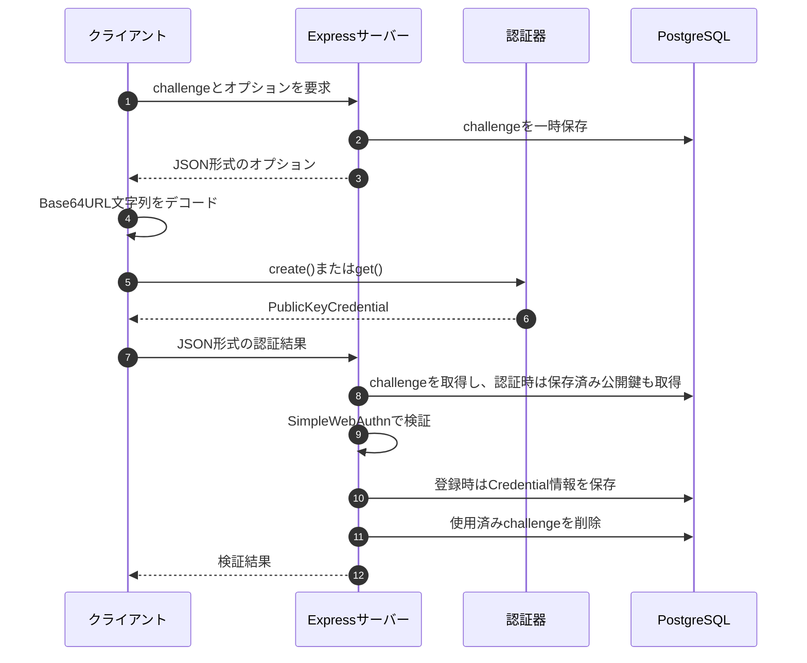

**
## はじめに

本記事では、ブラウザ標準のWebAuthn APIを直接呼び出し、サーバー側で`@simplewebauthn/server`を使って登録・認証結果を検証するまでを整理する。

前提となるパスキー、FIDO2、WebAuthn、認証器の関係は入門編で扱った。本記事の範囲は、登録・認証UIを表示した後、実際にブラウザとサーバーの間でデータを受け渡す部分である。

本記事で扱う実装は、[kapitantan/passkey_sandbox](https://github.com/kapitantan/passkey_sandbox)で確認できる。

今回の実装方針は次のとおりである。

- クライアントでは`@simplewebauthn/browser`を使用しない
- `navigator.credentials.create()`と`navigator.credentials.get()`を直接呼び出す
- サーバーでは`@simplewebauthn/server`を使用する
- challengeとパスキーの情報はPostgreSQLへ保存する

## 1. 使用技術

| 区分 | 使用技術 |
|---|---|
| フロントエンド | React、TypeScript、Vite |
| バックエンド | Express、TypeScript |
| WebAuthn検証 | `@simplewebauthn/server` 13系 |
| データベース | PostgreSQL、Prisma |
| ローカル環境のRP ID | `localhost` |
| ローカル環境のOrigin | `http://localhost:5173` |


## 2. 実装全体の対応関係

登録と認証では、呼び出すWebAuthn APIと`PublicKeyCredential.response`の具体的な型が異なる。
WebAuthnの`publicKey`オプションを指定した場合、その解決値は`PublicKeyCredential`または`null`になる。つまり、WebAuthnで返る外側の`PublicKeyCredential`は共通だが、その`response`に入るオブジェクトは登録と認証で異なる。
(Attestation: 認証器の登録証明 、Assertion: 署名付き認証応答)

| 処理 | 登録 | 認証 |
|---|---|---|
| WebAuthn API | `navigator.credentials.create()` | `navigator.credentials.get()` |
| APIへ渡すオプション | `PublicKeyCredentialCreationOptions` | `PublicKeyCredentialRequestOptions` |
| `publicKey`指定時の解決値 | `PublicKeyCredential \| null` | `PublicKeyCredential \| null` |
| `PublicKeyCredential.response` | `AuthenticatorAttestationResponse` | `AuthenticatorAssertionResponse` |
| `response`の主なプロパティ | `clientDataJSON`、`attestationObject` | `clientDataJSON`、`authenticatorData`、`signature`、`userHandle` |
| `response`の役割 | 新しく作成したCredentialと公開鍵情報を登録する | 登録済み秘密鍵で作成した署名によりCredentialの所持を証明する |
| 検証関数<br>(`@simplewebauthn/server`) | `verifyRegistrationResponse()` | `verifyAuthenticationResponse()` |




## 3. WebAuthn APIが扱うデータ

### 3.1 JSONとバイナリの境界

HTTP APIではchallengeやCredential IDをBase64URL文字列として扱う。

一方、WebAuthn APIの`challenge`、`user.id`、`excludeCredentials[].id`などは`BufferSource`を要求する。

そのため、以下のような変換処理が必要である。

```text
サーバー
Base64URL文字列
    ↓ デコード
ブラウザ
Uint8Array・ArrayBuffer
    ↓ navigator.credentials.create() / get()
認証器
```

`ArrayBuffer`はバイナリデータを保持するメモリ領域であり、`Uint8Array`はその内容を1バイトずつ参照するためのビューである。

```typescript
type BufferSource = ArrayBuffer | ArrayBufferView
```

今回のクライアントでは、Base64URL文字列を`Uint8Array`へ変換する処理を用意した。

### 3.2 登録オプション：`PublicKeyCredentialCreationOptions`


`navigator.credentials.create()`の`publicKey`へ渡す、登録用のオプションである。

```typescript
const credential = await navigator.credentials.create({
  publicKey: creationOptions,
})
```

主要なプロパティは次のとおりである。

- **必須プロパティ**
  - `challenge`、`rp`、`user`、`pubKeyCredParams`
- **任意プロパティ**
  - `timeout`、`excludeCredentials`、`authenticatorSelection`、`hints`、`attestation`、`extensions`

`BufferSource`は`ArrayBuffer | ArrayBufferView`を表し、実装では`Uint8Array`を渡すことが多い。具体的な値は後述のスニペットで示す。

型と取り得る値の全体像を簡略化すると次のようになる。`?`は任意プロパティ、`|`は複数の値のいずれかを表す。

```typescript
type PublicKeyCredentialCreationOptionsOverview = {
  challenge: ArrayBuffer | ArrayBufferView
  rp: {
    id?: string
    name: string
  }
  user: {
    id: BufferSource
    name: string
    displayName: string
  }
  pubKeyCredParams: Array<{
    type: 'public-key'
    alg: number // 代表例: -7 (ES256) | -257 (RS256) | -8 (EdDSA)
  }>
  timeout?: number
  excludeCredentials?: Array<{
    type: 'public-key'
    id: BufferSource
    transports?: Array<( "ble" | "hybrid" | "internal" | "nfc" | "smart-card" | "usb" )>
  }>
  authenticatorSelection?: {
    residentKey?: 'required' | 'preferred' | 'discouraged'
    userVerification?: 'required' | 'preferred' | 'discouraged'
    authenticatorAttachment?: 'platform' | 'cross-platform'
    requireResidentKey?: boolean
  }
  hints?: string[]
  attestation?: 'none' | 'indirect' | 'direct' | 'enterprise'
  extensions?: AuthenticationExtensionsClientInputs
}
```

- `challenge`（`BufferSource`、必須）
  - サーバーが生成する、登録処理ごとに異なるランダム値。リプレイ攻撃を防ぐために使用する。
  - サーバーは、返されたchallengeが発行済みの値と一致するか検証する。
  - HTTP APIではBase64URL文字列として受け取り、WebAuthn APIへ渡す前に`Uint8Array`などへ変換する。

- `rp`（`PublicKeyCredentialRpEntity`、必須）
  - パスキーを登録するWebサービスの情報をまとめたオブジェクト。
  - `id`（`string`、任意）
    - Relying Party ID。パスキーを利用できる範囲を決めるドメイン。
    - 省略すると、呼び出し元Originのドメインが使われる。
    - `https://example.com:3000`のようなスキーム（`https`）やポート番号（`3000`）は含めない。
    - 表示内容は環境によるが、今回確認したGoogle パスワード マネージャーでは「ウェブサイト」として表示された。
  - `name`（`string`、必須）
    - RPの人間向けの表示名。
    - 多くのクライアントで表示されないため、WebAuthn Level 3では非推奨。
    - 後方互換性のため、現在も必須メンバーとして残されている。
    - 安全な既定値として`rp.id`と同じ値を設定できる。
    - 仕様：[PublicKeyCredentialEntity](https://www.w3.org/TR/webauthn-3/#dictionary-pkcredentialentity)
　　
- `user`（`PublicKeyCredentialUserEntity`、必須）
  - 資格情報が作成されるユーザーアカウントを記述するオブジェクト。
  - `id`（`BufferSource`、必須）
    - サービス内部でユーザーを一意に識別する、不透明なID。
    - サービス側が用意した変更されない値を使う。メールアドレスなどの個人情報は直接入れない。
    - Discoverable Credentialを使った認証では、`userHandle`としてRPへ返される。

    > **Discoverable Credential**
    >
    > 以前のバージョンは2段階認証方式として設計されており、認証情報のIDが必要だったため、ユーザー名の入力が必要だった。
    > 
    > 認証器がRP IDに対応するアカウント情報とともに保持する公開鍵Credential。`allowCredentials`を省略した場合でも認証器がCredentialを検索できるため、ユーザー名を先に入力しない認証を実現できる。
    >
    > [Amazon Cognitoのネイティブなパスキー認証](https://docs.aws.amazon.com/cognito/latest/developerguide/amazon-cognito-user-pools-authentication-flow-methods.html#amazon-cognito-user-pools-passkeys)では、認証開始時にユーザー名が必要である。ユーザー名を先に入力しない構成にするには、例えばカスタム認証を使う設計が必要になる。参考：[Sign-in with passkey––without username](https://github.com/aws-samples/amazon-cognito-passwordless-auth/blob/main/FIDO2.md#sign-in-with-passkeywithout-username-usernameless)

  - `name`（`string`、必須）
    - ユーザーアカウントを見分けるための識別名。メールアドレスやユーザー名を指定することが多い。
    - 表示内容は環境によるが、今回確認したGoogle パスワード マネージャーでは「ユーザー名」として表示された。
  - `displayName`（`string`、必須）
    - ユーザーに見せるための読みやすい表示名。
    - W3Cの例でいきなり日本人名がでてきて驚いた<br>
    (例)`'Alex Müller'`、`'Alex Müller (ACME Co.)'`、`'田中倫'`。

- `pubKeyCredParams`（`PublicKeyCredentialParameters[]`、必須）
  - RPが対応する公開鍵資格情報の種類と署名アルゴリズムを、優先順に並べた配列。
  - `type`（`'public-key'`、必須）
    - 作成する公開鍵資格情報の種類。現在は`'public-key'`のみ。
  - `alg`（`number`、必須）
    - 公開鍵の署名アルゴリズムを示すCOSEアルゴリズムID。
    - 代表値は`-7` = ES256、`-257` = RS256、`-8` = EdDSA。
    - 幅広い認証器へ対応する場合は、実行環境で検証できることを確認したうえで`-8`、`-7`、`-257`を候補に含める。
    > **CBORとCOSE**
    >
    > CBOR（Concise Binary Object Representation）は、コンパクトなバイナリ形式のオブジェクト表現である。文字ベースのJSONと同様のデータ構造をCBORで表現すると、①サイズを小さくしやすい、②バイナリデータをそのまま扱える、③機械処理に適しておりWebAuthnやIoTで扱いやすい、という利点がある。
    >
    > COSE（CBOR Object Signing and Encryption）は、CBORで署名や暗号化を扱うための仕様である。JSONとJOSEの関係に近い。

- `timeout`（`number`、任意）
  - ブラウザへ伝える処理時間の目安。単位はミリ秒で、ブラウザが上書きする場合がある。
  - アクセシビリティを考慮すると、実運用では5分から10分程度よさそう

- `excludeCredentials`（`PublicKeyCredentialDescriptor[]`、任意）
  - 登録済みのCredential IDを指定し、同じ資格情報の重複登録を防ぐ。
  - 各要素は`type`、`id`、任意の`transports`を持つ。

- `authenticatorSelection`（`AuthenticatorSelectionCriteria`、任意）
  - 登録に使う認証器やユーザー検証の条件を指定するオブジェクト。
  - `residentKey`：`'required' | 'preferred' | 'discouraged'`。
    - Discoverable Credentialの必要性を指定する。自分の回の確認環境では`'discouraged'`を指定してもUI上の変化を確認できなかったが、指定の意味がなくなるわけではない。
  - `userVerification`：`'required' | 'preferred' | 'discouraged'`。
    - 生体認証やPINなどのユーザー検証の要求度を指定する。既定値は`'preferred'`。今回の確認環境で`'discouraged'`を指定すると、指紋認証なしでパスキーを作成できた。
  - `authenticatorAttachment`：`'platform' | 'cross-platform'`。
    - 端末内蔵または外部認証器に限定する場合に使う。今回の確認環境で`'cross-platform'`を指定すると、スマートフォンでQRコードを読み取るか、セキュリティキーを使用する必要があった。
  - `requireResidentKey`：`boolean`。
    - 後方互換用の旧プロパティで、新規実装では`residentKey`を使う。

<!-- - `hints`（`string[]`、任意）
  - ブラウザへ示す認証手段のヒント。代表値は`'client-device'`、`'security-key'`、`'hybrid'`で、ブラウザは無視できる。 -->

- `attestation`（`AttestationConveyancePreference`、任意）
  - Credentialの登録時に、使用された認証器の出所や特性を証明するAttestation情報を、RPへどのように伝えるか指定する。
  - `'none' | 'indirect' | 'direct' | 'enterprise'`から指定し、既定値は`'none'`で、一般向けのwebサービスではこれで十分である。

<!-- - `extensions`（`AuthenticationExtensionsClientInputs`、任意）
  - WebAuthn拡張へ渡す入力。利用する拡張ごとにオブジェクトの構造が異なる。 -->

パスキー登録としての説明用の最小例は次のようになる。`challengeResponse.challenge`は、サーバーが毎回新しく生成して返したBase64URL文字列とする。

```typescript
const userId = '550e8400-e29b-41d4-a716-446655440000'

const creationOptions: PublicKeyCredentialCreationOptions = {
  challenge: decodeBase64Url(challengeResponse.challenge),
  rp: {
    id: 'example.com',
    name: 'Example Service',
  },
  user: {
    id: new TextEncoder().encode(userId),
    name: 'alice@example.com',
    displayName: 'Alice',
  },
  pubKeyCredParams: [{ type: 'public-key', alg: -7 }],

}
```


### 3.3 登録時の`PublicKeyCredential`

`navigator.credentials.create()`に成功すると、`Credential`を継承した`PublicKeyCredential`が返される。登録時の`response`は`AuthenticatorAttestationResponse`である。

全体の形を簡略化すると、次のようになる。

```typescript
type RegistrationCredentialOverview = {
  authenticatorAttachment: 'platform' | 'cross-platform' | null
  id: string
  rawId: ArrayBuffer
  response: {
    clientDataJSON: ArrayBuffer
    attestationObject: ArrayBuffer
  }
  type: 'public-key'
}
```

- `authenticatorAttachment`: `AuthenticatorAttachment | null`
  - 使用された認証器の大分類。
  - 端末内蔵の認証器では`'platform'`、セキュリティキーなどの外部認証器では`'cross-platform'`になる。判定できない場合は`null`になる。
- `id`: `string`
  - Credential IDをBase64URL文字列で表した値。
  - `rawId`をBase64URLエンコードしたものに相当し、サーバーでは登録済みクレデンシャルを検索するキーとして保存する。
- `rawId`: `ArrayBuffer`
  - Credential IDの元のバイナリ値。
  - `id`と`rawId`は表現形式が異なるだけで、同じCredential IDを示す。
- `response`: `AuthenticatorAttestationResponse`
  - 認証器が生成した登録結果。
  - `clientDataJSON`と`attestationObject`を中心に、サーバーが登録結果を検証するためのデータを保持する。
  - `clientDataJSON`: `ArrayBuffer`
    - ブラウザが作成したクライアントデータのJSON文字列を、UTF-8のバイト列にしたもの。
    - `type`、`challenge`、`origin`、`crossOrigin`などを含む。
    - サーバーは`type`が`'webauthn.create'`であること、`challenge`が発行済みの値と一致すること、`origin`が許可したOriginであることなどを検証する。
    - 認証器には`clientDataJSON`そのものではなく、そのSHA-256ハッシュである`clientDataHash`が渡される。
  - `attestationObject`: `ArrayBuffer`
    - 認証器が作成した、CBOR形式のバイナリデータ。
    - CBORデコードすると、`fmt`、`authData`、`attStmt`の3要素を持つオブジェクトになる。
    - `authData`にはRP IDのハッシュ、フラグ、署名カウンターに加え、登録時に生成されたCredential IDと公開鍵などが含まれる。
- `type`: `'public-key'`
  - `Credential`から継承した資格情報の種類。WebAuthnでは`'public-key'`になる。

`clientDataJSON`は、次のようにデコードできる。

```typescript
const response = credential.response as AuthenticatorAttestationResponse
const jsonText = new TextDecoder().decode(response.clientDataJSON)
const clientData = JSON.parse(jsonText)
```

デコード後の内容は、概ね次のようになる。

```json
{
  "type": "webauthn.create",
  "challenge": "サーバーが発行したchallengeのBase64URL文字列",
  "origin": "https://example.com",
  "crossOrigin": false
}
```

`attestationObject`をCBORデコードした後の概念的な構造は、次のとおりである。

[6.5. Attestation](https://www.w3.org/TR/webauthn-3/#sctn-attestation)にattestation objectのレイアウトが載っている。

また、LINEヤフーのテックブログ（[デバイスとアプリの完全性保証からサービスリクエストの保護まで](https://techblog.lycorp.co.jp/ja/20240806a)）では、同社のデバイス証明サービスにおいて、AndroidとiOSを統一的に扱うためWebAuthnを参考に再構成した事例が紹介されている。

Attestationのそれぞれの役割や使われ方については調べれるほど出てきたので今回は値の概要に止めようと思う。今後必要になった際に詳細に調べることとする。

```typescript
type DecodedAttestationObject = {
  fmt: 'none' | 'packed' | 'tpm' | 'android-key' | 'android-safetynet' | 'fido-u2f' | 'apple' | 'compound' | 'android-key' 
  authData: Uint8Array
  attStmt: {
    ver?,  //TPM形式とandroid-safetynetで使用
    alg?,　//COSEアルゴリズム
    sig?,　//fmtで定めららた対象に対する署名値
    x5c?,  //X.509証明書チェーン
    certInfo?,  //TPM形式で使用
    pubArea?,   //TPM形式で使用
  }
}

// authDataの中身
type ParsedRegistrationAuthenticatorData = {
  rpIdHash: Uint8Array             // RP IDをSHA-256でハッシュした32バイト
  flags: number                    // UP、UV、AT、EDなどのビットフラグ
  signCount: number                // 署名カウンター
  attestedCredentialData: {
    aaguid: Uint8Array             // 認証器モデルを識別する16バイト
    credentialIdLength: number     // credentialIdのバイト長
    credentialId: Uint8Array       // 登録されたクレデンシャルの識別子
    credentialPublicKey: unknown   // COSE_Key形式の公開鍵
  }
  extensions?: unknown             // EDフラグが立っている場合に含まれる拡張データ
}
```

- `fmt`: `string`
  - アテステーションステートメントの形式。`'none'`、`'packed'`、`'fido-u2f'`、`'tpm'`、`'android-safetynet'`などがある。
- `authData`: バイト列
  - authenticator data を含む byte 配列
- `attStmt`: CBORマップ
  - 認証器やクレデンシャルの出所を検証するためのアテステーションステートメント。
  - 中身は`fmt`によって異なり、`fmt`が`'none'`なら空になる。

`AuthenticatorAttestationResponse`には、バイナリを取り出しやすくするためのメソッドも用意されている。
また後述の@simplewebauthn/serverにあるhelper関数を利用すれば値を確認することができる。

```typescript
response.getAuthenticatorData()    // authDataをArrayBufferで返す
response.getPublicKey()            // 公開鍵をSPKI形式で返す。取得できない場合はnull
response.getPublicKeyAlgorithm()   // 公開鍵のCOSEアルゴリズムIDを返す
response.getTransports()           // 認証器との通信手段の一覧を返す
```

#### `ArrayBuffer`、`Uint8Array`

- `ArrayBuffer`
  - JavaScriptでバイナリデータを保持するためのメモリ領域。
  - `challenge`やCredential IDなどのバイト列に使われるが、`ArrayBuffer`自体から各バイトを直接読み書きはしない。
- `Uint8Array`
  - `ArrayBuffer`を1バイトずつ、0〜255の整数として読み書きするためのビュー。
  - 新しいデータを複製するとは限らず、同じ`ArrayBuffer`を参照できる。

```typescript
const buffer = new ArrayBuffer(4)
const view = new Uint8Array(buffer)

view.set([10, 20, 30, 255])

console.log(buffer.byteLength)  // 4
console.log(view)               // Uint8Array(4) [10, 20, 30, 255]
console.log(view.buffer === buffer) // true
```


### 3.4 認証オプション：`PublicKeyCredentialRequestOptions`

`navigator.credentials.get()`の`publicKey`へ渡す、認証用のオプションである。

```typescript
const credential = await navigator.credentials.get({
  publicKey: requestOptions,
})
```

主要なプロパティは次のとおりである。

- **必須プロパティ**
  - `challenge`
- **任意プロパティ**
  - `timeout`、`rpId`、`allowCredentials`、`userVerification`、`hints`、`extensions`


型と取り得る値の全体像を簡略化すると次のようになる。

```typescript
type PublicKeyCredentialRequestOptionsOverview = {
  challenge: ArrayBuffer | ArrayBufferView
  timeout?: number
  rpId?: string
  allowCredentials?: Array<{
    type: 'public-key'
    id: BufferSource
    transports?: Array<
      'internal' | 'hybrid' | 'usb' | 'nfc' | 'ble' | 'smart-card'
    >
  }>
  userVerification?: 'required' | 'preferred' | 'discouraged'
}
```

- `challenge`（`BufferSource`、必須）
  - サーバーが認証処理ごとに生成する、一度きりのランダム値。型と役割は登録時と同じ

- `rpId`（`string`、任意）
  - 認証対象のRelying Party ID。認証器は、このRP IDに紐づくCredentialを探す。
  - 登録時に使用したRP IDと一致する必要がある。
  - 型と役割は登録時と同じ

- `allowCredentials`（`PublicKeyCredentialDescriptor[]`、任意、既定値は空配列）
  - 認証に使用できるCredential IDの一覧。ユーザー名などからアカウントを先に特定できる場合は、そのアカウントに登録されたCredentialを列挙する。
  - 値を指定した場合、そのどれも使用できなければ認証は失敗する。配列の先頭ほど優先度が高い。
  - 省略または空配列にした場合、特定のCredential IDへ絞り込まず、認証器がRP IDに対応するDiscoverable Credentialを探す。ユーザー名を先に入力しないパスキー認証では、この形を使用する。
  - 各要素は、次のプロパティを持つ。
  - `type`（`'public-key'`、必須）
    - 公開鍵資格情報の種類。現在は`'public-key'`のみ。
  - `id`（`BufferSource`、必須）
    - 使用を許可するCredential IDのバイナリ値。
    - 認証成功時は、選ばれたCredential IDが`PublicKeyCredential.rawId`に入る。
  - `transports`（`AuthenticatorTransport[]`、任意）
    - ブラウザが認証器への接続方法を判断するためのヒント。
    - `internal`は端末内蔵認証器、`usb`はUSB、`nfc`はNFC、`ble`はBluetooth Low Energy、`smart-card`はスマートカード、`hybrid`は別端末とのハイブリッド認証を表す。
    - `hybrid`の代表例は、PCでログインするときにスマートフォンのパスキーを使うクロスデバイス認証である。

- `userVerification`（`UserVerificationRequirement`、任意、既定値は`'preferred'`）
  - 生体認証や端末PINなどによるユーザー検証を、どの程度要求するか指定する。
  - `'required'`: ユーザー検証を必須にする。実行できない、または検証に成功しない場合は認証を失敗させる。
  - `'preferred'`: 可能ならユーザー検証を行うが、対応できない認証器でも処理を継続できる。
  - `'discouraged'`: ユーザー検証をなるべく要求しない。ユーザーによる操作確認そのものを不要にする設定ではない。

<!-- 
- `hints`（`string[]`、任意、既定値は空配列）
  - RPが想定する認証手段をブラウザへ伝え、アカウント選択画面などの案内に利用してもらうためのヒント。
  - `'client-device'`は現在の端末、`'security-key'`はセキュリティキー、`'hybrid'`は別端末を使う認証を示す。
  - あくまでヒントであり、ブラウザは無視できる。利用できる認証器を強制的に制限するプロパティではない。
-->

- `timeout`（`number`、任意）
  - ブラウザへ伝える認証処理時間の目安。型と役割は登録時と同じ

<!-- 
  - `extensions`（`AuthenticationExtensionsClientInputs`、任意）
  - 認証時にWebAuthn拡張へ渡す入力。
  - 値の構造は、`appid`、`largeBlob`、`prf`など利用する拡張ごとに異なる。
   -->
<!-- 
ユーザー名を先に入力しない、一般的なパスキー認証の例は次のようになる。`challengeResponse.challenge`は、サーバーが認証処理ごとに新しく生成して返したBase64URL文字列とする。

```typescript
const requestOptions: PublicKeyCredentialRequestOptions = {
  challenge: decodeBase64Url(challengeResponse.challenge),
  rpId: 'example.com',
  userVerification: 'required',
  // Discoverable Credentialから選択するためallowCredentialsは省略する
}
```

ユーザー名などからアカウントを先に特定し、そのアカウントのCredentialだけを許可する例は次のようになる。

```typescript
const requestOptions: PublicKeyCredentialRequestOptions = {
  challenge: decodeBase64Url(challengeResponse.challenge),
  rpId: 'example.com',
  allowCredentials: registeredPasskeys.map(passkey => ({
    type: 'public-key' as const,
    id: decodeBase64Url(passkey.credentialId),
    transports: passkey.transports,
  })),
  userVerification: 'required',
  timeout: 60_000,
  hints: ['client-device', 'security-key'],
}
``` -->

### 3.5 認証時の`PublicKeyCredential`

`navigator.credentials.get()`に成功すると、登録時と同じく`PublicKeyCredential`が返される。ただし、認証時の`response`は`AuthenticatorAssertionResponse`であり、登録時とは中身が少し異なる。

全体の形を簡略化すると、次のようになる。

```typescript
type AuthenticationCredentialOverview = {
  authenticatorAttachment: 'platform' | 'cross-platform' | null
  id: string
  rawId: ArrayBuffer
  response: {
    clientDataJSON: ArrayBuffer
    authenticatorData: ArrayBuffer
    signature: ArrayBuffer
    userHandle: ArrayBuffer | null
  }
  type: 'public-key'
}
```

- `authenticatorAttachment`: `AuthenticatorAttachment | null`
  - 使用された認証器の大分類。型と役割は登録時と同じ
- `id`: `string`
  - 認証に使用されたCredential IDをBase64URL文字列で表した値。型と役割は登録時と同じ
- `rawId`: `ArrayBuffer`
  - `id`と同じCredential IDの元のバイナリ値。型と役割は登録時と同じ
- `response`: `AuthenticatorAssertionResponse`
  - 登録済みの秘密鍵によって作成された認証結果。
  - `clientDataJSON`: `ArrayBuffer`
    - ブラウザが作成したクライアントデータのJSON文字列を、UTF-8のバイト列にしたもの。
    - 型、役割、エンコード形式は登録時と同じだが、内容は異なる。
    - 登録時の`type`は`"webauthn.create"`、認証時は`"webauthn.get"`となる
  - `authenticatorData`: `ArrayBuffer`
    - 登録時の`'attestationObject.authData'`から`'attestedCredentialData'`と`'extensions'`を省略した形。
    - なので、`'rpIdHash'`, `'flags'`, `'signCount'`が含まれる
  - `signature`: `ArrayBuffer` **認証時に生成**
    - 認証器が登録済みの秘密鍵で作成した署名。
    - 署名対象は、`authenticatorData`と`SHA-256(clientDataJSON)`を連結したバイト列である。
    - サーバーはCredential IDに対応する保存済み公開鍵で検証する。署名のエンコード形式は、ES256やRS256など使用したアルゴリズムによって異なる。
  - `userHandle`: `ArrayBuffer | null`　　**認証時に生成**
    - 登録時に`user.id`へ指定した、RP内部でユーザーを識別する不透明なID。
    - ユーザー名やメールアドレスそのものではない。
    - `allowCredentials`を省略または空配列にした認証では必ず返され、ユーザー名を先に入力しないログインでアカウントを特定するために使える。
    - `allowCredentials`でCredential IDを指定した場合は、`null`になることがある。値が返された場合は、Credential IDに紐づくユーザーと一致することをサーバーで確認する。
- `type`: `'public-key'`
  - 資格情報の種類。WebAuthnでは`'public-key'`になる。型と役割は登録時と同じ

<!-- 
署名対象と検証に使用する鍵の関係は、次のようになる。

```text
署名対象 = authenticatorData || SHA-256(clientDataJSON)

認証器: 登録済み秘密鍵で署名を作成
RP:     保存済み公開鍵で署名を検証
``` -->

ブラウザの開発者ツールでは、概ね次のような形で確認できる。各`ArrayBuffer`の長さは、使用する認証器、アルゴリズム、拡張などによって変わる。

```javascript
PublicKeyCredential {
  authenticatorAttachment: "platform",
  id: "GACW3i3iUnSFh-0fjTeDYg",
  rawId: ArrayBuffer(16),
  response: AuthenticatorAssertionResponse {
    clientDataJSON: ArrayBuffer(243)
    authenticatorData: ArrayBuffer(37),
    signature: ArrayBuffer(70),
    userHandle: ArrayBuffer(16),
  },
  type: "public-key"
}
```

認証結果は登録時と同じように、後述の@simplewebauthn/serverのhelper関数を活用すれば確認することができる。

## 4. challenge発行API

challengeはブラウザではなく、信頼できるサーバー側で生成する。推測が困難なランダム値とし、有効期限を設け、検証成功後に一度だけ消費する必要がある。


```typescript
import crypto from 'crypto'

const CHALLENGE_TTL_MS = 5 * 60 * 1000

app.post('/api/challenge', async (req, res) => {
  const username = req.body.username ?? ''
  const challenge = crypto.randomBytes(32).toString('base64url')
  const expiredAt = new Date(Date.now() + CHALLENGE_TTL_MS)

  const registeredPasskeys = username
    ? await prisma.passkey.findMany({ where: { username } })
    : []
  const userId = registeredPasskeys[0]?.userId
    ?? crypto.randomBytes(16).toString('base64url')

  await prisma.challenge.create({
    data: { challenge, username, userId, expiredAt },
  })

  res.json({
    challengeResponse: {
      challenge,
      rp: {
        id: 'localhost',
        name: 'localhost',
      },
      user: {
        id: userId,
        name: username,
        displayName: username,
      },
      pubKeyCredParams: [
        { type: 'public-key', alg: -7 },
        { type: 'public-key', alg: -257 },
      ],
      excludeCredentials: registeredPasskeys.map(passkey => ({
        type: 'public-key',
        id: passkey.credentialId,
      })),
      timeout: 60_000,
    },
  })
})
```

`user.id`には、ユーザー名とは別の、変更されない不透明な内部ユーザーIDを設定する。上のAPIではそのIDをBase64URL文字列で生成し、challengeと一緒に保存している。登録処理ではクライアントから送られたIDを信用せず、サーバーに保存したchallengeの`userId`をパスキーと対応付ける。

`timeout: 60_000`は説明用の短い値である。実運用では利用者が操作を完了するための時間を考慮し、5分から10分程度の値を検討する。

この実装では登録と認証で同じAPIを使用している。エンドポイントを共通化する場合でも、実運用では保存するchallengeに`registration`または`authentication`の用途を関連付け、検証時に用途が一致することを必ず確認する。これにより、登録用challengeが認証に使われるなどの処理の混同を防ぐ。

## 5. 登録処理

### 5.1 サーバーのJSONを登録用オプションへ変換する

サーバーから受け取ったchallengeとCredential IDは文字列であるため、WebAuthn APIへ渡す前にバイナリへ変換する。

```typescript
const toCreationOptions = (
  value: RegisterChallengeResponse,
): PublicKeyCredentialCreationOptions => ({
  challenge: decodeBase64Url(value.challenge),
  rp: value.rp,
  user: {
    id: decodeBase64Url(value.user.id),
    name: value.user.name,
    displayName: value.user.displayName,
  },
  pubKeyCredParams: value.pubKeyCredParams,
  excludeCredentials: value.excludeCredentials.map(credential => ({
    type: credential.type,
    id: decodeBase64Url(credential.id),
  })),
  timeout: value.timeout,
  authenticatorSelection: {
    residentKey: 'required',
    userVerification: 'required',
  },
  attestation: 'none',
})
```

### 5.2 `navigator.credentials.create()`を呼び出す

```typescript
const registerPasskey = async (username: string) => {
  const optionsResponse = await fetch('/api/challenge', {
    method: 'POST',
    headers: { 'Content-Type': 'application/json' },
    body: JSON.stringify({ username }),
  })

  const { challengeResponse } = await optionsResponse.json()
  const publicKey = toCreationOptions(challengeResponse)

  const credential = await navigator.credentials.create({ publicKey })

  if (!(credential instanceof PublicKeyCredential)) {
    throw new Error('PublicKeyCredential was not returned')
  }

  const verificationResponse = await fetch('/api/register', {
    method: 'POST',
    headers: { 'Content-Type': 'application/json' },
    body: JSON.stringify({
      username,
      challenge: challengeResponse.challenge,
      credential,
    }),
  })

  if (!verificationResponse.ok) {
    throw new Error('Registration verification failed')
  }
}
```

`PublicKeyCredential`はバイナリ値を含む。WebAuthn Level 3の`toJSON()`に対応したブラウザでは、JSONシリアライズ時にBase64URL文字列へ変換できる。対応差を吸収したい場合は、明示的な変換処理または`@simplewebauthn/browser`を利用する。

### 5.3 `verifyRegistrationResponse()`で検証する

サーバーでは、ブラウザから受け取った登録結果を`verifyRegistrationResponse()`へ渡す。

```typescript
import { verifyRegistrationResponse } from '@simplewebauthn/server'

const RP_ID = 'localhost'
const ORIGIN = 'http://localhost:5173'

const verification = await verifyRegistrationResponse({
  response: {
    id: credential.id,
    rawId: credential.rawId,
    response: {
      clientDataJSON: credential.response.clientDataJSON,
      attestationObject: credential.response.attestationObject,
    },
    clientExtensionResults: credential.clientExtensionResults ?? {},
    type: 'public-key',
  },
  expectedChallenge: storedChallenge.challenge,
  expectedOrigin: ORIGIN,
  expectedRPID: RP_ID,
})
```

主に次の内容が検証される。

- `clientDataJSON.type`が登録を表す`webauthn.create`であること
- 返されたchallengeがサーバーに保存した値と一致すること
- Originが`expectedOrigin`と一致すること
- 認証器データ内のRP IDハッシュが`expectedRPID`と一致すること
- アテステーションと公開鍵資格情報の構造が妥当であること
- 要求したユーザー検証条件を満たすこと

検証に成功すると、`registrationInfo.credential`から保存対象を取得できる。

```typescript
if (!verification.verified || !verification.registrationInfo) {
  throw new Error('Registration verification failed')
}

if (!storedChallenge.userId) {
  throw new Error('User ID is not associated with the challenge')
}

const {
  id,
  publicKey,
} = verification.registrationInfo.credential

await prisma.passkey.create({
  data: {
    credentialId: id,
    userId: storedChallenge.userId,
    username,
    publicKey: Uint8Array.from(publicKey),
  },
})
```

秘密鍵はサーバーへ送られない。サーバーが保存する中心的な情報はCredential ID、公開鍵、ユーザーとの対応である。署名カウンターに対応する場合はcounterを、次回の認証器選択を補助する場合はtransportsも保存する。

## 6. 認証処理

### 6.1 認証用オプションを作る

`navigator.credentials.get()`へusernameを渡すことはない。`PublicKeyCredentialRequestOptions`にもusernameというプロパティは存在しない。

一般的なパスキーログインでは`allowCredentials`を省略し、認証器やパスワードマネージャーにRP IDと対応するアカウントを表示させる。ユーザーが選択したパスキーのCredential IDや`userHandle`を使い、認証結果を受け取ったサーバーがユーザーを特定する。

ユーザー名を先に入力する構成も仕様上は可能である。その場合も`get()`へusernameを渡すのではなく、アプリケーションがusernameから登録済みCredential IDを検索し、`allowCredentials`へ指定する。

```typescript
const toRequestOptions = (
  value: RegisterChallengeResponse,
): PublicKeyCredentialRequestOptions => ({
  challenge: decodeBase64Url(value.challenge),
  rpId: value.rp.id,
  timeout: value.timeout,
  userVerification: 'required',
})
```

### 6.2 `navigator.credentials.get()`を呼び出す

```typescript
const authenticatePasskey = async () => {
  const optionsResponse = await fetch('/api/challenge', {
    method: 'POST',
    headers: { 'Content-Type': 'application/json' },
    body: JSON.stringify({}),
  })

  const { challengeResponse } = await optionsResponse.json()
  const publicKey = toRequestOptions(challengeResponse)

  const credential = await navigator.credentials.get({ publicKey })

  if (!(credential instanceof PublicKeyCredential)) {
    throw new Error('PublicKeyCredential was not returned')
  }

  const verificationResponse = await fetch('/api/login', {
    method: 'POST',
    headers: { 'Content-Type': 'application/json' },
    body: JSON.stringify({
      challenge: challengeResponse.challenge,
      credential,
    }),
  })

  if (!verificationResponse.ok) {
    throw new Error('Authentication verification failed')
  }
}
```

ユーザー名を先に入力しない認証では、サーバーは返された`userHandle`でユーザーを特定し、そのユーザーに`credential.id`が属することを照合する。照合できたCredential IDに対応する保存済み公開鍵を、署名検証に使用する。

### 6.3 `verifyAuthenticationResponse()`で検証する

認証結果の`userHandle`とCredential IDを使って登録時の公開鍵を取得し、`verifyAuthenticationResponse()`へ渡す。

```typescript
import { verifyAuthenticationResponse } from '@simplewebauthn/server'

const userId = credential.response.userHandle

if (typeof userId !== 'string' || !userId) {
  throw new Error('User handle was not returned')
}

const storedPasskey = await prisma.passkey.findFirst({
  where: {
    userId,
    credentialId: credential.id,
  },
})

if (!storedPasskey) {
  throw new Error('Passkey not found')
}

const verification = await verifyAuthenticationResponse({
  response: {
    id: credential.id,
    rawId: credential.rawId,
    response: credential.response,
    authenticatorAttachment: credential.authenticatorAttachment,
    clientExtensionResults: credential.clientExtensionResults ?? {},
    type: 'public-key',
  },
  expectedChallenge: storedChallenge.challenge,
  expectedOrigin: ORIGIN,
  expectedRPID: RP_ID,
  credential: {
    id: storedPasskey.credentialId,
    publicKey: Uint8Array.from(storedPasskey.publicKey),
    counter: 0,
  },
})
```

主に次の内容が検証される。

- `clientDataJSON.type`が認証を表す`webauthn.get`であること
- challenge、Origin、RP IDが期待値と一致すること
- UP・UVフラグが要求を満たすこと
- 登録済み公開鍵で署名を検証できること
- 署名カウンターを使う場合、今回値と保存値の関係が不自然でないこと

#### counterと`newCounter`

署名カウンターに対応する認証器は、認証に成功するたびにカウンターを増やし、`authenticatorData`内の`signCount`としてRPへ返す。RPサーバーは前回の値をCredentialごとに保存し、次の認証で認証器が返した値と比較する必要がある。`verifyAuthenticationResponse()`の`credential.counter`に渡すのはこの保存値であり、検証成功後の`authenticationInfo.newCounter`には今回認証器が返した値が入る。サーバー側で`1`を加算した値ではない。

ただし、署名カウンターを使用しない認証器は`signCount`を常に`0`として返す。今回、私がGoogle パスワード マネージャーで作成したパスキーを確認した範囲では、`signCount`と`newCounter`はともに`0`であり、この環境では署名カウンターを使用していないように見えた。そのため、今回の実装では検証関数へ渡す`credential.counter`に`0`を設定している。これは今回の環境とCredentialでの確認結果であり、Google パスワード マネージャーがすべての環境で署名カウンターを使用しないことを示すものではない。

保存値と今回値がともに`0`の場合、署名カウンターによる比較は行われない。そのためカウンターによるクローンの兆候検知はできないが、challenge、Origin、RP ID、UP・UVフラグ、署名などの検証は引き続き行われる。将来`newCounter`が`0`以外になる認証器も対象にする場合は、Credentialごとにcounterを保存し、認証成功後に保存値を`newCounter`で更新する。詳細は[WebAuthn Level 3のSignature Counter Considerations](https://www.w3.org/TR/webauthn-3/#sctn-sign-counter)を参照。

## 7. challengeを一度だけ消費する

challengeの一致を確認するだけでは、同じchallengeを再利用できる余地が残る。有効期限内であることを確認し、検証に成功した後で削除する。

```typescript
const storedChallenge = await prisma.challenge.findUnique({
  where: { challenge: requestChallenge },
})

if (!storedChallenge || storedChallenge.expiredAt <= new Date()) {
  throw new Error('Challenge is invalid or expired')
}

// verifyRegistrationResponse()または
// verifyAuthenticationResponse()を実行する

await prisma.challenge.delete({
  where: { challenge: storedChallenge.challenge },
})
```

`deleteMany()`を使う場合は、例外が発生しなかったことだけでなく`count === 1`を確認する必要がある。削除件数が`0`なら、すでに使用済みか、保存条件が一致していない。認証や登録を成功として確定するのは、challengeを一度だけ消費できたことを確認した後にする。

上の`findUnique()`と`delete()`は流れを示すための簡略例であり、同じchallengeに対する処理が同時に実行される可能性がある。実運用ではトランザクションや条件付き削除を使用し、検証とchallengeの消費が競合しても1件だけ成功するようにする。

アカウント選択前にchallengeを発行する場合、その時点ではユーザーが確定していない。そのため、challengeを空のユーザー名で保存して後から確定したユーザー名で削除すると条件が一致しない。challenge自体、セッションID、または認証処理IDを基準に一度だけ消費する設計が必要である。

## 8. データベースへ保存する情報

[kapitantan/passkey_sandbox](https://github.com/kapitantan/passkey_sandbox)では、challengeとパスキーを次の2テーブルに保存している。`userId`は変更されない不透明な内部ユーザーIDであり、登録時の`user.id`に設定する。登録時はchallengeに保存した`userId`をパスキーへ引き継ぎ、認証時は`userHandle`として返された値がCredential IDの所有者と一致することを照合する。`username`は表示や検索に使う値であり、`user.id`とは区別する。

```prisma
model Challenge {
  challenge String   @id
  expiredAt DateTime
  userId    String?
  username  String
}

model Passkey {
  credentialId String   @id
  userId       String
  username     String
  publicKey    Bytes
  createdAt    DateTime @default(now())
}
```

今回確認したGoogle パスワード マネージャーのCredentialでは署名カウンターが`0`のままだったため、現在のスキーマにcounter列は設けていない。署名カウンターを利用する認証器への対応や実運用を想定する場合は、次の情報も保持する。

```prisma
model Passkey {
  credentialId String   @id
  userId       String
  publicKey    Bytes
  counter      BigInt
  transports   String[]
  deviceType   String?
  backedUp     Boolean?
  createdAt    DateTime @default(now())
  lastUsedAt   DateTime?
}
```

| 保存項目 | 用途 |
|---|---|
| Credential ID | 認証に使われたパスキーの検索 |
| ユーザーID | パスキーとアカウントの対応 |
| 公開鍵 | 認証時の署名検証 |
| counter | 署名カウンターを利用する場合に、認証器複製の兆候を検知する補助情報 |
| transports | 次回認証時に接続方法をブラウザへ伝えるヒント |
| deviceType・backedUp | single-device／multi-deviceやバックアップ状態の管理 |

## 9. なぜ`@simplewebauthn/server`だけ使ったのか

クライアント側では、WebAuthn APIがブラウザ標準として提供されているため、次の2つを直接呼び出せる。

```typescript
navigator.credentials.create({ publicKey: creationOptions })
navigator.credentials.get({ publicKey: requestOptions })
```

一方、サーバー側では次の処理が必要になる。

- `clientDataJSON`のデコードと検証
- CBOR形式の`attestationObject`のデコード
- 固定フィールドと可変長データからなる`authenticatorData`の解析
- COSE形式の公開鍵の取り扱い
- Origin、RP IDハッシュ、UP・UVフラグの検証
- アテステーション形式ごとの検証
- 登録済み公開鍵による署名検証
- 署名カウンターの検証

これらを独自実装すると、実装量だけでなくセキュリティ上の判断箇所も増える。そのため、今回の実装ではサーバー検証に`@simplewebauthn/server`を使用した。

## 10. `@simplewebauthn/browser`を使う場合

`@simplewebauthn/browser`はWebAuthn APIを置き換えるものではなく、`create()`と`get()`の呼び出しやJSON・バイナリ変換を扱いやすくするラッパーである。

```typescript
// 今回の直接実装
navigator.credentials.create({ publicKey: creationOptions })
navigator.credentials.get({ publicKey: requestOptions })

// @simplewebauthn/browserを使う場合
startRegistration({ optionsJSON })
startAuthentication({ optionsJSON })
```

主な利点は次のとおりである。

- Base64URL文字列と`Uint8Array`・`ArrayBuffer`の変換を任せられる
- `PublicKeyCredential`をサーバーへ送信しやすいJSON形式へ変換できる
- `browserSupportsWebAuthn()`などで対応状況を判定できる
- Conditional UIによるパスキーのオートフィルを導入しやすい
- WebAuthn処理の重複実行を中断できる
- `WebAuthnError`でエラー原因を扱いやすくできる

ただし、サーバーからオプションを取得する処理と、認証結果をサーバーへ送る処理は自動化しない。`fetch`などの通信処理はアプリケーション側で実装する。

今回はWebAuthn APIへ渡す型、バイナリ変換、返り値の内容を確認することが目的であったため、クライアント用ライブラリは使用しなかった。実運用で変換処理やブラウザ差異への対応を減らす場合は、導入する利点が大きい。

## 11. 実装時の確認事項

- challengeはサーバー側で十分な長さのランダム値として生成する
- challengeに有効期限を設け、検証成功後に一度だけ消費する
- 登録用challengeと認証用challengeの用途を分ける
- `expectedOrigin`にはスキームとポートを含むOriginを指定する
- `expectedRPID`にはスキームとポートを含まないRP IDを指定する
- `user.id`には変更されない不透明なユーザーIDを使用する
- アカウント選択式のログインではDiscoverable Credentialを登録する
- ユーザー名を先に入力しない認証では、`userHandle`でユーザーを特定し、Credential IDがそのユーザーに属することを照合する
- 署名カウンターを利用する場合は、検証成功後に保存値を`newCounter`で更新する
- 検証前のデータを信用してログイン済みセッションを発行しない
- 本番環境ではHTTPSを使用する

## まとめ

今回の実装では、ブラウザ標準のWebAuthn APIを直接呼び出すことで、登録・認証時のオプションと`PublicKeyCredential`の構造を確認した。

クライアント側の中心は、Base64URL文字列とバイナリ値を変換し、`create()`または`get()`を呼び出す処理である。サーバー側の中心は、challenge、Origin、RP ID、署名を検証し、Credential ID、公開鍵、内部ユーザーIDの対応を保存する処理である。署名カウンターを利用する場合は、認証後に`newCounter`も保存する。

WebAuthn APIを直接利用するとデータの流れを理解しやすい。一方、実運用では`@simplewebauthn/browser`と`@simplewebauthn/server`を組み合わせることで、変換処理と検証処理の独自実装を減らせる。

## 参考資料

- [W3C Web Authentication Level 3](https://www.w3.org/TR/webauthn-3/)
- [W3C Credential Management Level 1](https://www.w3.org/TR/credential-management-1/)
- [`@simplewebauthn/server`公式ドキュメント](https://simplewebauthn.dev/docs/packages/server)
- [`@simplewebauthn/browser`公式ドキュメント](https://simplewebauthn.dev/docs/packages/browser/)
- [MDN：Web Authentication API](https://developer.mozilla.org/ja/docs/Web/API/Web_Authentication_API)
- [MDN：CredentialsContainer.create()](https://developer.mozilla.org/ja/docs/Web/API/CredentialsContainer/create)
- [MDN：CredentialsContainer.get()](https://developer.mozilla.org/ja/docs/Web/API/CredentialsContainer/get)
**