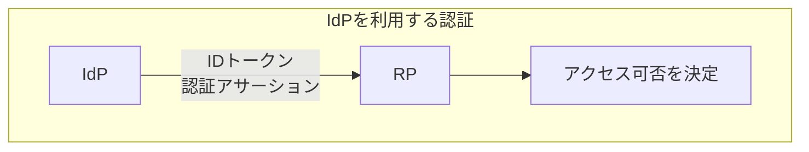
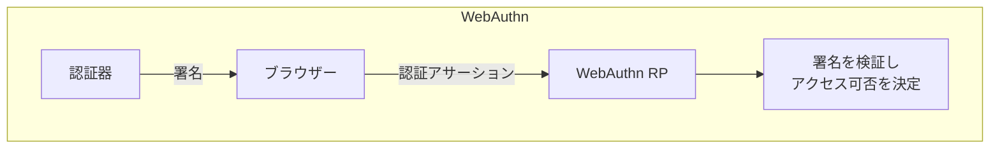
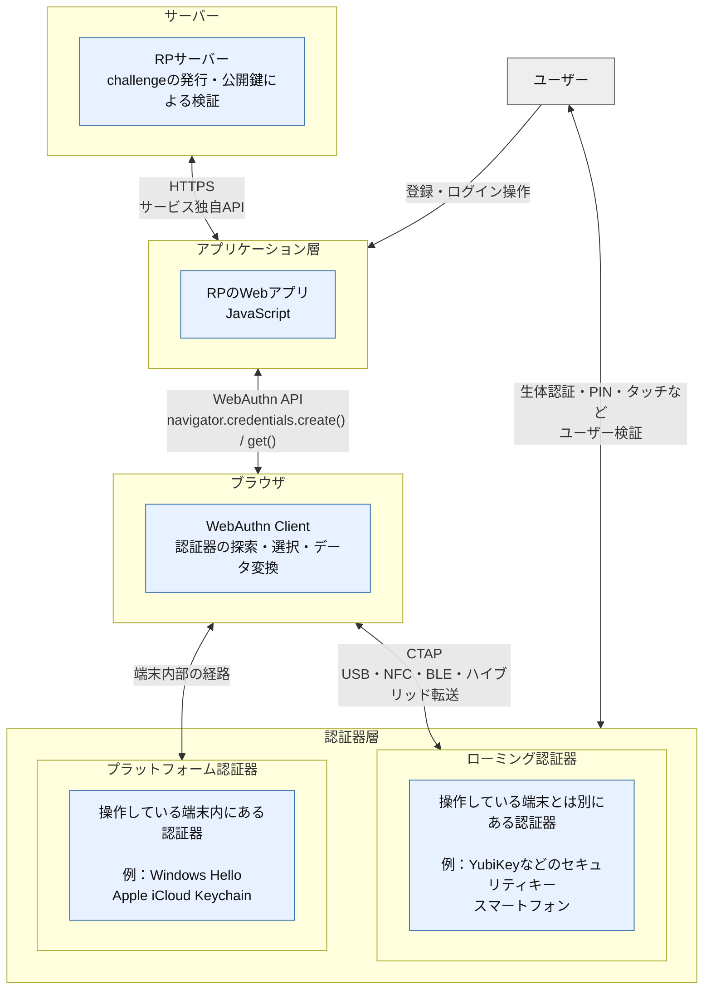
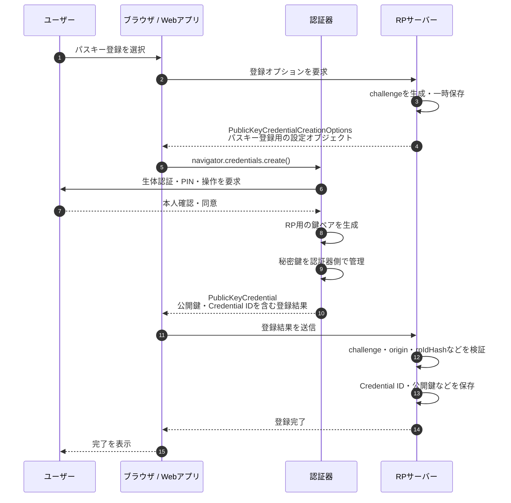
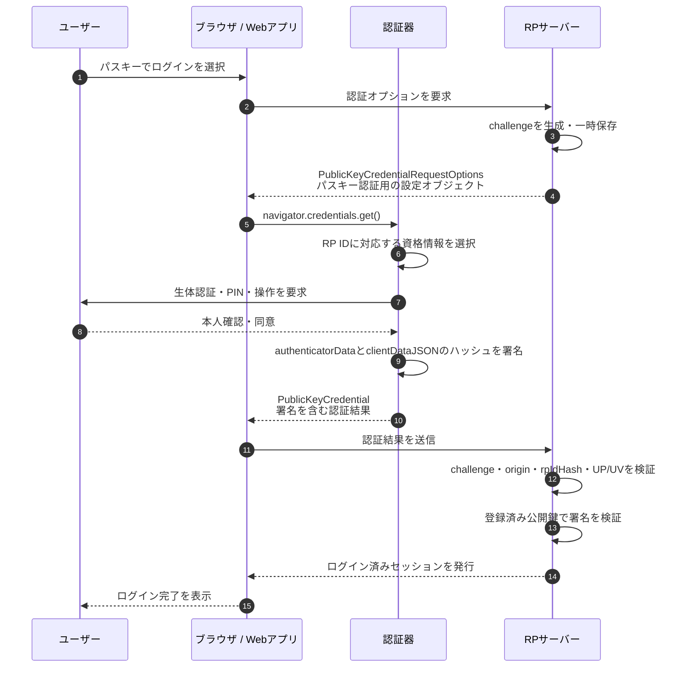

# パスキー入門：実装前に押さえたいFIDO2・WebAuthnの全体像

> **この記事のゴール**  
> パスキーを「生体認証でログインする機能」ではなく、**誰が・どの鍵を持ち・何を検証している仕組みなのか**で説明できるようになる。

## はじめに

入社後、パスキー周辺の実装に触れる機会があったため、調べた内容を整理した。

この記事は読み物というより、復習用メモとして構成している。
実装コードを動かす前に押さえたい全体像を対象とし、実際に登録・認証画面を呼び出す手順は次の記事に書いた。

---

## 1. まず一文で理解する

> パスキーは、認証器が保持する秘密鍵でサーバーからの要求に署名し、サーバーが登録済みの公開鍵でその署名を検証する認証方式である。

最低限、次の4点を押さえる。

1. **秘密鍵**は認証器側で管理され、RP（サービス）へは送られない
2. **公開鍵**は登録時にRPのサーバーへ保存される
3. 認証時は、サーバーが一度きりのランダム値である**challenge**を発行する
4. 指紋・顔・PINなどは、認証器に秘密鍵を使わせるための**端末内の本人確認**であり、生体情報そのものがRPへ送られるわけではない

パスキーでは、FIDO2として知られるWebAuthnとCTAPの標準が利用されている。
[FIDO Alliance: Passkeys](https://fidoalliance.org/passkeys/)

※RP：Relying Party（信頼当事者）。認証を示す情報（アサーションやクレーム）を根拠にユーザーを認証し、リソースへのアクセス可否を決める主体である。WebAuthnでは通常、認証器から受け取った署名を検証するWebサービスとそのサーバーを指す。IdPは必須ではない。




[MDN:Relying party (信頼当事者)](https://developer.mozilla.org/ja/docs/Glossary/Relying_party)

[ISO/IEC JTC 1/SC 27: Glossary of IT Security Terminology](https://committee.iso.org/files/live/sites/jtc1sc27/files/resources/CD%206%20-%20Glossary%2020250902.pdf)

---

## 2. パスワード認証から何が変わるのか

| 観点 | パスワード認証 | パスキー認証 |
|---|---|---|
| ユーザーが扱うもの | 文字列の秘密情報 | 端末の生体認証・PINなど |
| サーバーが保存する主な情報 | パスワードのハッシュ | 公開鍵、Credential IDなど |
| 認証時の確認 | 入力値から得たハッシュを照合 | 秘密鍵による署名を公開鍵で検証 |
| フィッシングへの耐性 | 偽サイトへ入力してしまう可能性がある | 資格情報がRP IDに紐づくため、別ドメインでは利用できない |

### 改善される主な問題

- **使い回し**：サービスごとに異なる公開鍵資格情報が作られる
- **フィッシング**：資格情報は登録先のRP IDにスコープされる
- **サーバーからの秘密情報流出**：RPは認証用の秘密鍵を保存しない
- **操作性とのトレードオフ**：ユーザーは端末で普段使う生体認証やPINを利用できる

---

## 3. 用語の関係

### 3.1 FIDO

**FIDO（Fast IDentity Online）**は、公開鍵暗号を利用してパスワードへの依存を減らす認証技術・仕様の総称である。仕様の策定と普及はFIDO Allianceが進めている。

```text
FIDO認証仕様
├── FIDO 1.0
│   ├── UAF：パスワードレス認証
│   └── U2F：パスワード認証の第2要素
│             └── 後にCTAP1として整理
│
└── FIDO2
    ├── WebAuthn：Webアプリから公開鍵資格情報を扱う仕様
    └── CTAP：クライアントと外部認証器の通信仕様
```

### 3.2 FIDO2

**FIDO2 = WebAuthn + CTAP**と捉えると、全体像を整理しやすくなる。

| 用語 | 策定主体 | 担当範囲 |
|---|---|---|
| WebAuthn | W3C | 公開鍵資格情報の登録・認証に使うWeb API、データ形式、RP側の検証手順 |
| CTAP | FIDO Alliance | ブラウザやOSなどのクライアントと外部認証器の通信 |

- WebAuthnの入口は、登録時の `navigator.credentials.create()` と認証時の `navigator.credentials.get()`
- CTAPは、USB・NFC・BLEなどでセキュリティキーや別端末を利用するときに使われる

仕様の全体像は[FIDO Allianceの仕様ページ](https://fidoalliance.org/specifications/)と[W3C WebAuthn Level 3](https://www.w3.org/TR/webauthn-3/)で確認できる。

### FIDO2の通信規格と担当範囲

FIDO2の主要な構成要素を、サーバー、アプリケーション、ブラウザ、認証器の順に並べると、次のように整理できる。



---

## 4. 登録フロー

登録は、**鍵ペアを作り、公開鍵をRPへ保存する処理**である。

### 流れ

1. ユーザーがRPで「パスキーを登録する」を選ぶ
2. RPサーバーがランダムな `challenge` と登録用オプションを作る
3. Webアプリが `navigator.credentials.create()` を呼ぶ
4. 認証器がユーザーの同意・本人確認を行う
5. 認証器がRP用の秘密鍵・公開鍵ペアを作る
6. 秘密鍵は認証器側で管理し、公開鍵を含む登録結果をブラウザへ返す
7. RPサーバーが `challenge`、`origin`、RP IDに関する情報などを検証する
8. RPサーバーがCredential ID、公開鍵、ユーザーとの対応などを保存する

### 登録フロー図

図中では、1行目にWebAuthnで使われる型名、2行目にそのオブジェクトの役割を簡潔に記載する。



> **challengeの役割**  
> 登録・認証のたびにRPが生成する、十分なランダム性を持つ一度きりの値である。以前のレスポンスを再利用するリプレイ攻撃を防ぐため、RPは信頼できるサーバー側で生成し、返ってきた値との一致を確認する。


## 5. 認証フロー

認証は、**登録済みの秘密鍵を持っていることを署名で証明する処理**である。

### 流れ

1. ユーザーが「パスキーでログイン」を選ぶ
2. RPサーバーが新しい `challenge` と認証用オプションを作る
3. Webアプリが `navigator.credentials.get()` を呼ぶ
4. ブラウザ・OSがRP IDに対応する資格情報を認証器へ要求する
5. 認証器が生体認証・PINなどでユーザーを確認する
6. 認証器が登録済み秘密鍵で署名を作る
7. RPサーバーが登録済み公開鍵で署名を検証する
8. すべての検証に成功したら、RPがログイン済みセッションを発行する

### 認証フロー図



### 「challengeに署名する」の正確な意味

自分ではよくchallengeに対して署名すると言ってしまうが、実際の署名対象はchallenge単体ではない。
概念的には次のデータである。

```text
authenticatorData || SHA-256(clientDataJSON)
```

- `clientDataJSON`：ブラウザが作るデータ。`type`、`challenge`、`origin`などを含む
- `authenticatorData`：認証器が作るデータ。`rpIdHash`、ユーザー操作・本人確認のフラグ、`signCount`などを含む
- `signature`：上記データに対し、登録済み秘密鍵で作られた署名

この構造により、RPは署名検証と合わせて次の点を確認できる。

- 今回発行したchallengeへの応答か
- 期待したoriginからの要求か
- 期待したRP ID向けの資格情報か
- ユーザーの操作や、必要な本人確認が行われたか
- 登録済み秘密鍵を保持しているか


## 5. 復習用まとめ

### 最小用語表

| 用語 | 一言でいうと |
|---|---|
| Passkey | FIDO2 / WebAuthnに基づく公開鍵資格情報 |
| FIDO2 | WebAuthnとCTAPを中心とする仕様群 |
| WebAuthn | Webアプリから公開鍵資格情報を作成・利用するW3C標準 |
| CTAP | クライアントと外部認証器の通信仕様 |
| RP | パスキー認証を利用するサービス |
| Authenticator | 秘密鍵を管理し、本人確認後に署名する認証器 |
| Credential ID | 登録した公開鍵資格情報を識別するID |
| Challenge | RPが発行する、一度きりのランダム値 |
| RP ID | 資格情報の利用範囲を決めるドメイン識別子 |

### 自分で説明できるか確認する

- [ ] パスキーを公開鍵・秘密鍵・署名の3語を使って説明できる
- [ ] 登録と認証の違いを説明できる
- [ ] `create()`と`get()`の役割を区別できる
- [ ] RP、ブラウザ、認証器がそれぞれ何をするか説明できる
- [ ] 生体情報がRPへ送られない理由を説明できる
- [ ] パスキーがフィッシングに強い理由をRP IDとoriginで説明できる
- [ ] サーバー側に保存する情報を3つ挙げられる

---

## 次に確認すること

次の記事では、DevToolsのコンソールから `navigator.credentials.create()` と `navigator.credentials.get()` を呼び出し、登録・認証のポップアップが表示されるところまでを確認する。そのうえで、入力するオプションと、登録・認証結果を表す `PublicKeyCredential` の中身を整理する。

---

## 参考資料

- [FIDO Alliance: Passkeys](https://fidoalliance.org/passkeys/)
- [FIDO Alliance: Specifications](https://fidoalliance.org/specifications/)
- [W3C: Web Authentication Level 3](https://www.w3.org/TR/webauthn-3/)
- [Apple Developer: Supporting passkeys](https://developer.apple.com/documentation/AuthenticationServices/supporting-passkeys)
- [Microsoft Learn: WebAuthn API](https://learn.microsoft.com/en-us/windows/win32/webauthn/-webauthn-portal)
